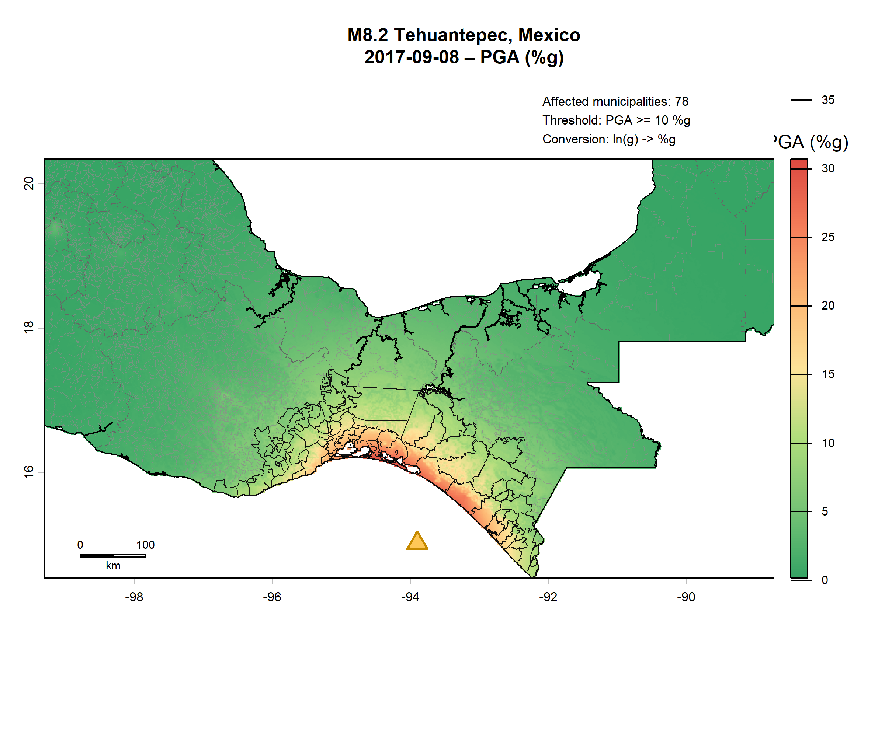
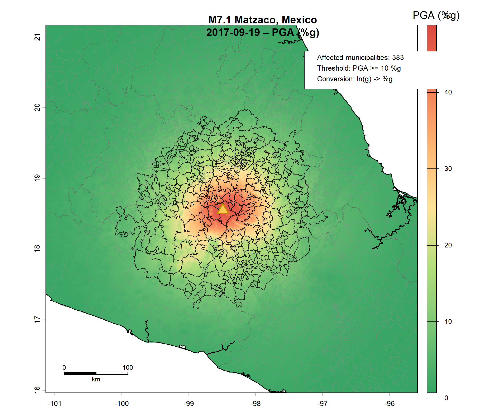

```{r setup, include=FALSE}
options(width = 60) 

knitr::opts_chunk$set(
  fig.width  = 10,
  fig.height = 5,
  out.width  = "90%",
  fig.align  = "center",
  tidy       = TRUE,
  tidy.opts  = list(width.cutoff = 60),
  echo       = TRUE,
  warning    = FALSE,
  message    = FALSE
)
```

```{r libraries, results='hide', echo=FALSE}
rm(list=ls())
library(readxl)        # read excel files
library(stringr)       # string operations
library(terra)         # raster operations
library(exactextractr) # exact_extract() for distances
library(gdistance)     # fast distance() formula for geo data
library(sf)            # vector operations
library(spData)        # geo data
library(tidyverse)     # NOTE: tidyr::extract() masks terra::extract()
library(ggrepel)       # add labels to ggplot
library(tidyterra)     # visualize geospatial using tidy syntax
library(patchwork)     # patch tg ggplot objects
library(did2s)
library(BMisc)
library(DRDID)
library(nprobust)   # Local polynomial regression for dose-response curve
library(cobalt)     # Covariate balance
library(stringi)
```

# Abstract

Does the severity of an earthquake determine the magnitude of remittance inflows to affected municipalities in its aftermath? Existing macro-level studies address this question using country or state-level data, leaving within-country heterogeneity across municipalities unexplored. A smaller literature exploits household-level survey data but relies on a binary treatment indicator, comparing affected to unaffected units, and therefore cannot identify how the remittance response varies with shock intensity. This project bridges these two approaches by combining municipality-level remittance data with a categorical measure of seismic intensity based on peak ground acceleration (PGA), allowing us to trace the remittance response across a spectrum of earthquake severity rather than collapsing exposure into a single binary indicator.

Working at this level of granularity raises two empirical challenges that a binary, aggregate design would not show. First, spatial spillovers through migration networks and geographic proximity between neighboring municipalities may violate the Stable Unit Treatment Value Assumption (SUTVA), biasing conventional estimates. Second, a categorical treatment can reveal non-linearities in the dose-response relationship, with effects that differ in both magnitude and sign across intensity levels.

To investigate these questions, we construct a municipality-quarter panel of formal remittance inflows to Mexico, merging administrative data from Banco de Mexico with PGA raster data from the USGS ShakeMap program for ten significant seismic events (M6.7--M8.2) between 2014 and 2022. We partition treated municipalities into three intensity bins and estimate group-time average treatment effects using the Callaway and Sant'Anna (2021) estimator, which accommodates the staggered timing of earthquake cohorts while avoiding the negative-weighting bias existent in two-way fixed effects. The results reveal a non-monotonic relationship between seismic intensity and remittance inflows, in which municipalities exposed to low-to-moderate shaking (PGA 4--20%g) experience a statistically significant increase in remittances of approximately 0.5 asinh units, consistent with the consumption-smoothing reasoning documented in the literature. By contrast, municipalities subjected to the most severe intensity (PGA above 20%g) show a significant decline of roughly the same magnitude, consistent with disaster-induced outmigration reducing the pre-existing remittance structure. These findings are robust to replacing never-treated controls with the lowest-dose treated group. We further test for spillover effects using both a migration-network weighting matrix and an inverse-distance spatial weights matrix, finding limited evidence that SUTVA violations alter the baseline estimates.

# Introduction

In 2024 alone, Mexico received more than 67 billion current US dollars in remittances, making it the second largest recipient country in the world by nominal inflows, behind only India [@worldbank2026]. Remittances are not only a steady income source, but they also act as an insurance mechanism. Indeed, migrants increase transfers when an adverse shock hits household in their municipality of origin, reducing the real income of their family [@lucas_stark1985; @bettin2023]. Mexico is one of the most seismically active countries in the world because of its location over three of the major tectonic plates [@rhea2011]. On 7 September 2017, a magnitude 8.2 earthquake struck the coast of Chiapas, followed approximately two weeks later by a magnitude 7.1 event near Puebla, the latter one causing the collapse of 44 buildings and severely damaging another 600 [@singh2018]. The combination of persistent high-volume remittance flows and frequent seismic events makes Mexico an ideal setting for studying how earthquake severity affects remittance responses.

A growing literature examines how remittances respond to natural disasters. [@mohapatra2012] use cross-country data and find that remittances rise significantly after disasters, particularly in countries with a large stock of migrants. [@bettin2025] exploit monthly bilateral remittance data from Italy to 81 countries and estimate an immediate 2% increase following natural disaster events, with flows reverting back to their pre-shock level within approximately one year. While informative, both of these papers operate at the country level, leaving open the question of whether these effects survive at a more granular scale. Our approach exploits municipality level data, which may completely change our estimates, since strong network effects (e.g. migrants from neighboring less-affected municipalities sending remittances to the hardest-hit localities) could attenuate or even reverse the aggregate country-level signal.

A smaller set of papers achieves this finer level of granularity using household or municipality data. The closest antecedent to our project is the doctoral dissertation by [@ornelas2022], which analyzes the impact of natural disasters on remittance flows across Mexican municipalities. However, despite working at the municipality level, the author treats disaster exposure as a binary variable, classifying each municipality as either affected or unaffected. Contrary to the broader literature on remittances as an insurance mechanism, the study finds that remittance levels decrease after a natural disaster. This apparent contradiction may be a consequence of the binary treatment specification, because the binary indicator averages the remittance response over both mildly and severely affected localities. If mildly hit municipalities experience little change or even a slight decline in remittances, while more severely hit municipalities receive substantially larger inflows, these opposing effects may cancel out when using a binary treatment variable.

Our research project addresses this gap by combining municipality-level remittance data with an ordered categorical seismic intensity measure based on peak ground acceleration (PGA) rather than collapsing earthquake exposure to a binary indicator. This allows the remittance response to vary non-linearly across the categories of seismic severity, letting us test whether the insurance-driven response documented at the macro level is concentrated among the most severely affected localities and whether it disappears or reverses for less severely affected ones.

# Data

## Remittance Data

The outcome variable is quarterly formal remittance inflows at the municipality level (in millions of nominal U.S. Dollars), sourced from Banco de México SIE table CE166 - *Ingresos por Remesas, distribución por municipio* - [@banxico2025].

```{r}
# Read the excel skipping the metadata rows
remit_raw <- read_excel(
  "data/remittances/remittances.xlsx",
  skip = 8,
  col_types = "text"
)
```

After loading the raw data, we reshape it to long format and parse the date column, appending year and quarter variables for clarity.

```{r}
# Convert to long format
remit_long <- remit_raw %>%
  select(-`Information type`) %>% # Drop levels columns
  pivot_longer(
    cols      = -c(Title, Serie),
    names_to  = "quarter_label",
    values_to = "remittances_musd"
  ) %>%
  mutate(remittances_musd = as.numeric(remittances_musd))

# Convert quarter column to date format
remit_long <- remit_long %>%
  mutate(
    date    = as.Date(as.numeric(quarter_label), origin = "1899-12-30"),
    year    = as.integer(format(date, "%Y")),
    quarter = ceiling(as.integer(format(date, "%m")) / 3)
  ) %>%
  select(-quarter_label) # drop the old quarter column
```

Since the raw file includes state-level aggregate rows alongside municipality observations, we drop the former and retain only municipality-level data. Finally, we parse the raw name column, which encodes state and municipality as a single string, splitting it into two distinct columns to facilitate merging with other data sources and improve readability.

```{r}
# Tidy up municipality names
remit_long <- remit_long %>%
  # keep only remittances rows (drop state-level aggregates)
  filter(str_detect(Title, "Distribution by municipality")) %>%
  mutate(
    state        = str_trim(str_extract(Title, "(?<=, )[^,]+(?=, [^,]+$)")),
    municipality = str_trim(str_extract(Title, "[^,]+$"))
  ) %>%
  select(-Title)  # drop the original Title column

# Drop unused columns and rearrange columns
remit_long <- remit_long %>%
  select(-date, -Serie) %>%
  select(state, municipality, year, quarter, remittances_musd)
```

In the next section, we run sanity checks and report descriptive statistics.

```{r}
# Check number of municipalities, states, and total quarters
n_munic_pairs <- remit_long %>% distinct(state, municipality) %>% nrow()
n_states      <- n_distinct(remit_long$state)
n_obs         <- nrow(remit_long)
quarters      <- remit_long %>% distinct(year, quarter) %>% nrow()

# Check if there are any NAs
na_summary <- remit_long %>%
  summarise(across(everything(), ~ sum(is.na(.x)))) %>%
  pivot_longer(everything(), names_to = "variable", values_to = "n_missing") %>%
  filter(n_missing > 0)

cat(
  "Unique state-municipality pairs:", n_munic_pairs, "\n",
  "States:", n_states, "\n",
  "Quarters:", quarters, "\n",
  "Total observations:", n_obs, "\n",
  "Expected (balanced):", n_munic_pairs * quarters, "\n",
  if (nrow(na_summary) == 0) "No missing values in any column.\n"
    else paste("Columns with missing values:\n", 
               paste(na_summary$variable, collapse = ", "), "\n")
)
```

The panel comprises of 2,463 municipalities across 32 states and 52 quarters, yielding a total of 128,076 municipality-quarter observations. The panel is fully balanced, with no municipality missing data for any quarter.

```{r}
# Share of 0s across the whole dataset
zero_share <- mean(remit_long$remittances_musd == 0, na.rm = TRUE)
cat("Share of zero observations:", scales::percent(zero_share, accuracy = 0.1), "\n")

# Flag municipalities that never received remittances
munic_always_zero <- remit_long %>%
  group_by(state, municipality) %>%
  summarise(
    always_zero = all(remittances_musd == 0, na.rm = TRUE),
    .groups = "drop"
  )

# State-level summary
remit_long %>%
  group_by(state) %>%
  summarise(
    n_obs             = n(), # number of observations
    n_zero_obs        = sum(remittances_musd == 0, na.rm = TRUE), # number of 0s
    share_zero_obs    = mean(remittances_musd == 0, na.rm = TRUE) # share of 0s
  ) %>%
  left_join(
    munic_always_zero %>%
      group_by(state) %>%
      summarise(
        n_never_received  = sum(always_zero),
      ),
    by = "state"
  ) %>%
  arrange(desc(share_zero_obs)) %>%
  slice(1:5, (n() - 4):n()) # report only first 5 and last 5
```

Approximately 23% of observations record zero remittance inflows, reflecting quarters in which no formal transfers were registered for a given municipality. The incidence of zeros varies substantially across States: Oaxaca reports the biggest share, with nearly 50% of its observations equal to zero, followed by Yucatán (41.6%), Tlaxcala (33.7%), Puebla (29.1%), and Chiapas (25.8%). Ciudad de México is the only State without zeros across the entire sample period. Moreover, at the municipality level, only four municipalities record zero remittances in every single quarter.

```{r}
# Compute outliers as observations 5 standard deviations away from the mean
remit_long <- remit_long %>%
  group_by(state, municipality) %>%
  mutate(
    mean_r  = mean(remittances_musd, na.rm = TRUE),
    sd_r    = sd(remittances_musd, na.rm = TRUE),
    outlier = remittances_musd > mean_r + 5 * sd_r
  ) %>%
  ungroup()

cat("Potential outlier observations:", sum(remit_long$outlier, na.rm = TRUE), "\n")

remit_long %>%
  filter(outlier) %>%
  select(state, municipality, year, quarter, remittances_musd) %>%
  arrange(desc(remittances_musd)) %>%
  print(n = 20)
```

A municipality-level outliers check flags 305 observations exceeding five standard deviations above each municipality's mean, which are less than 0.3% of the total sample. Three observations are attributed to municipalities labelled *"Unidentified"* within San Luis Potosí, Zacatecas, and Jalisco, possibly reflecting remittances that *Banxico* could not assign to a specific locality within the State. Later, we will drop them from the analysis as they cannot be matched to geographic or seismic data. The remaining flagged observations correspond to large municipalities, which regularly receive among the highest remittance inflows in the country, as well as to isolated quarterly spikes in low-remittance municipalities. We retain all such observations in the main analysis, as these likely reflect real transfers rather than data errors.

```{r}
# Non-rescaled remittance plot
p_levels <- remit_long %>%
  filter(remittances_musd > 0) %>% # include only non-zero observations
  ggplot(aes(x = remittances_musd)) +
  geom_histogram(bins = 60, fill = "#4393c3", colour = "white", linewidth = 0.2) +
  labs(
    title = "Distribution of Quarterly Remittance Inflows (non-zero observations)",
    x     = "Remittances (Millions USD)",
    y     = "Count"
  ) +
  theme_minimal(base_size = 12) +
  theme(plot.title = element_text(hjust = 0.5))
p_levels
```

The distribution of quarterly remittance inflows is highly right-skewed, with the majority of observations concentrated near zero and a long upper tail driven by a small number of high-remittance urban municipalities. To address this, we apply the inverse hyperbolic sine (asinh) transformation to the outcome variable, defined as $asinh(x) = ln(x + \sqrt{x^2+1})$. This transformation compresses the long right tail of the distribution, making the coefficient estimates less sensitive to extreme observations. Moreover, unlike the common $ln(x+1)$ alternative, the *asinh* transformation doesn't need any specific handling for zeros, as $asinh(0) = 0$, and it behaves approximately linearly near zero and logarithmically for large values, retaining the standard approximate percentage-change interpretation of log-linearised models. We scale remittances to thousands of USD prior to transformation, ensuring that the bulk of non-zero observations fall in the log-like regime of the function rather than the near-linear region near zero.

```{r}
# Rescale remittances
remit_long <- remit_long %>%
  mutate(remittances_kusd = remittances_musd * 1000,
         asinh_remittances = asinh(remittances_kusd))

# Asinh scale plot
p_asinh <- remit_long %>%
  filter(remittances_kusd > 0) %>%
  ggplot(aes(x = asinh_remittances)) +
  geom_histogram(bins = 60, fill = "#4393c3", colour = "white", linewidth = 0.2) +
  labs(
    title = "Distribution of Quarterly Remittance Inflows (non-zero observations)",
    x     = "asinh(remittances) - Thousands USD",
    y     = "Count"
  ) +
  theme_minimal(base_size = 12) +
  theme(plot.title = element_text(hjust = 0.5))
p_asinh
```

After transformation, the distribution takes on an approximately bell-shaped form centred around $asinh ≈ 8–9$, confirming that the *asinh* transformation successfully symmetrised the heavily right-skewed raw data. For reference, the following table converts integer *asinh* values back to their original scale in thousands of USD.

| asinh value | Original value (thousands USD) | Interpretation              |
|:------------|:-------------------------------|:----------------------------|
| 1           | \~\$1.2k                       | Near-zero, negligible flows |
| 3           | \~\$10k                        | Small rural municipality    |
| 5           | \~\$74k                        | Small-medium municipality   |
| 7           | \~\$548k                       | Medium municipality         |
| 9           | \~\$4M                         | Large municipality          |
| 10          | \~\$11M                        | Major urban centre          |
| 11          | \~\$30M                        | Largest municipalities      |

The small spike near zero at the left edge of the distribution corresponds to municipalities with inflows just above zero, which remain in the near-linear region of the transformation and thus appear compressed near the origin. The bulk of the distribution, peaking around $asinh ≈ 8-9$, equivalent to around \$1.5M-\$4M per quarter, represents mid-sized municipalities and constitutes the economically meaningful core of the estimation sample

```{r}
# Compute average quarterly remittance inflows by municipality
munic_summary <- remit_long %>%
  group_by(state, municipality) %>%
  summarise(avg_quarterly = mean(remittances_musd, na.rm = TRUE), .groups = "drop")

# Compute share of quarterly remittance inflows by municipality
total_avg_quarterly <- sum(munic_summary$avg_quarterly)
munic_summary <- munic_summary %>%
  mutate(
    share = avg_quarterly / total_avg_quarterly * 100,
    label = paste0(municipality, " (", state, ")")
  )

# Top 15 
top15_nominal <- munic_summary %>%
  arrange(desc(avg_quarterly)) %>%
  slice_head(n = 15)

top15_share <- munic_summary %>%
  arrange(desc(share)) %>%
  slice_head(n = 15)
```


```{r, echo=FALSE}
# Plot of nominal remittance inflows
p1 <- ggplot(top15_nominal,
             aes(x = reorder(label, avg_quarterly), y = avg_quarterly)) +
  geom_col(fill = "#2166ac") +
  coord_flip() +
  labs(
    title = "Nominal Inflows",
    x     = NULL,
    y     = "Mean Quarterly Inflows (M USD)"
  ) +
  theme_minimal(base_size = 11) +
  theme(plot.title = element_text(hjust = 0.5))

# Plot of share of remittance inflows
p2 <- ggplot(top15_share,
             aes(x = reorder(label, share), y = share)) +
  geom_col(fill = "#4393c3") +
  coord_flip() +
  scale_y_continuous(labels = function(x) paste0(x, "%")) +
  labs(
    title = "Share of National Total",
    x     = NULL,
    y     = "Share of National Total (%)"
  ) +
  theme_minimal(base_size = 11) +
  theme(plot.title = element_text(hjust = 0.5))

# Combine plots
combined <- p1 + p2 +
  plot_annotation(
    title   = "Top 15 Municipalities by Average Quarterly Remittance Inflows",
    caption = "Source: Banco de México, CE166",
    theme   = theme(plot.title = element_text(size = 14, face = "bold", hjust = 0.5))
  )
combined
```

The distribution of remittances across municipalities exhibits a fairly high concentration among a small number of large cities. As shown in the figure, Tijuana (Baja California) leads with an average quarterly inflow of around 140 million USD, followed closely by Guadalajara (Jalisco), Puebla (Puebla) and Morelia (Michoacán), each receiving around 110 to 120 million USD per quarter. However, no single municipality accounts for more than approximately 1.5% of total national remittances, with shares steeply declining from Tijuana's 1.4% to Juárez (Chihuahua)'s 0.6%.

```{r}
# Compute national aggregate time series
national_ts <- remit_long %>%
  group_by(year, quarter) %>%
  summarise(total = sum(remittances_musd, na.rm = TRUE), .groups = "drop") %>%
  mutate(date = as.Date(paste0(year, "-", (quarter - 1) * 3 + 1, "-01")))
```

```{r, echo=FALSE}
# Plot national aggregate time series
ggplot(national_ts, aes(x = date, y = total)) +
  geom_line(linewidth = 0.8, colour = "#2166ac") +
  scale_y_continuous(labels = scales::comma) +
  labs(
    title    = "Total Quarterly Remittance Inflows to Mexico",
    subtitle = "All municipalities, Q1 2013 - Q4 2025",
    x        = NULL,
    y        = "Millions of USD",
    caption  = "Source: Banco de México, CE166"
  ) +
  theme_minimal(base_size = 12) +
  theme(plot.title = element_text(hjust = 0.5)) +
  theme(plot.subtitle = element_text(hjust = 0.5))
```

Total quarterly remittance inflows at the national level grew steadily throughout the sample period, rising from approximately 5,000 million USD in early 2013 to a peak of around 17,500 million USD in the quarters preceding 2025, more than tripling in nominal terms. This growth substantially outpaced US inflation, which accumulated approximately 35% over the same period [@bls2026], implying a real increase of well over 100%. Notably, the COVID-19 pandemic does not appear to have disrupted the upward trend, with no visible break in the series during 2020-2021.

## Earthquake Data

We source ShakeMap raster data from the USGS Earthquake Hazard Program [@usgs2026] for 10 significant seismic events (Magnitude 6.7 to Magnitude 8.2) affecting Mexican territory between 2014 and 2022. For each event, we read the `HDF5` ShakeMap file, construct a georeferenced peak ground acceleration raster (PGA), and compute municipality-level mean PGA using municipal boundaries from the Instituto Nacional de Estadística y Geografía (INEGI). We prefer using PGA over earthquake magnitude for several reasons. Earthquake magnitude captures total energy released at the focus of the earthquake, and is therefore a single scalar quantity which does not vary across space. On the other hand, PGA measures the maximum acceleration experienced by a small mass at specific geographic locations, expressed in units of gravitational acceleration (*g*) [@wald1999]. As a consequence, two earthquakes of identical magnitude can produce different PGA at a given municipality depending on the depth of the earthquake's focus and local site conditions. Since damage to buildings and infrastructure is related more closely to ground motion rather than the magnitude of the earthquake itself [@pga_wiki], PGA provides a consistent and physically meaningful measure for comparing seismic exposure across events of different magnitude, depth, and distance from the affected municipalities.

The earthquakes included in our sample are summarized in the following table.

| Event | Date | Magnitude | Location |
|----|----|----|----|
| 2014 Coyuquilla Norte | April 18, 2014 | M7.2 | Guerrero |
| 2014 Puerto Madero | July 7, 2014 | M6.9 | Chiapas-Guatemala border |
| 2017 Chiapas | September 7, 2017 | M8.2 | Off coast of Chiapas |
| 2017 Matzaco (Puebla) | September 19, 2017 | M7.1 | Puebla/Morelos |
| 2018 Pinotepa | February 16, 2018 | M7.2 | Oaxaca |
| 2019 Puerto Madero | February 1, 2019 | M6.6-6.7 | Chiapas |
| 2020 Santa María Xadani | June 23, 2020 | M7.4 | Oaxaca |
| 2021 Acapulco | September 7, 2021 | M7.0 | Guerrero |
| 2022 Aguililla | September 19, 2022 | M7.6 | Michoacán |
| 2022 Aguililla (aftershock) | September 22, 2022 | M6.8 | Michoacán |

: \>6.5Mw Seismic events in Mexico, 2014-2022 {#tbl-earthquakes}

The first steps to load the data involves a project root detection to ensure the code is properly running when shared.

```{r}
# Project root detection
if (requireNamespace("here", quietly = TRUE)) {
  proj_root <- here::here()
} else if (requireNamespace("rstudioapi", quietly = TRUE) &&
           rstudioapi::isAvailable()) {
  proj_root <- rstudioapi::getActiveProject()
  if (is.null(proj_root)) proj_root <- getwd()
} else {
  proj_root <- getwd()
}
cat("Project root:", proj_root, "\n")

# Directory layout: input
data_dir   <- file.path(proj_root, "Project Geospatial","data", "earthquakes")

if (!dir.exists(data_dir))   stop("Data folder not found: ", data_dir,
                                  "\nPlace ShakeMap HDF5 and shapefiles there.")
```

Install and load the specific packages to handle the earthquake data set. `rhdf5` (from Bioconductor) handles reading the HDF5 binary format. `terra` provides all raster and vector spatial operations. `jsonlite` parses the JSON metadata embedded inside the HDF5 file.

```{r}
if (!requireNamespace("BiocManager", quietly = TRUE)) install.packages("BiocManager")
if (!requireNamespace("rhdf5",       quietly = TRUE)) BiocManager::install("rhdf5", update = FALSE, ask = FALSE)
if (!requireNamespace("terra",       quietly = TRUE)) install.packages("terra")
if (!requireNamespace("jsonlite",    quietly = TRUE)) install.packages("jsonlite")

library(rhdf5)
library(terra)
library(jsonlite)
```

Define the earthquake event parameters:

```{r}
# Edit these for each individual earthquake event to map
event_folder  <- "2014_M7.2_coyuquilla_norte" # change this when switching earthquakes
epicenter_lon <- -100.972
epicenter_lat <-  17.397
eq_magnitude  <-  7.2
eq_depth_km   <-  24.0
eq_date       <- "2014-04-18"
eq_title      <- "M7.2 Coyuquilla Norte, Mexico"
```

File paths are assembled from the project root and event folder. Every required file is checked for existence before proceeding.

```{r}
# Input paths
hdf_path        <- file.path(data_dir, event_folder, "shake_result.hdf")
admin0_path     <- file.path(data_dir, "mex_admin0/mex_admin0.shp") # Country
admin1_path     <- file.path(data_dir, "mex_admin1/mex_admin1.shp") # States
municipios_path <- file.path(data_dir, "mex_admin2/mex_admin2.shp") # Municipalities

# Verify all inputs exist before starting expensive operations
for (fp in c(hdf_path, admin0_path, admin1_path, municipios_path)) {
  if (!file.exists(fp)) stop("Required file not found: ", fp)
}

# Output directory (created if it doesn't already exist)
output_dir <- file.path(proj_root, "Project Geospatial", "output", event_folder)
if (!dir.exists(output_dir)) dir.create(output_dir, recursive = TRUE)
```

Three small helpers are defined here to keep the main code readable. They handle common edge cases in HDF5 metadata: missing values, mixed types, and the difference between cell-center and cell-edge coordinate conventions.

```{r}
`%||%` <- function(a, b) if (!is.null(a)) a else b

as_num <- function(x) {
  if (is.null(x) || length(x) == 0) return(NA_real_)
  v <- tryCatch(suppressWarnings(as.numeric(unlist(x, use.names = FALSE))),
                error = function(e) NA_real_)
  if (length(v) == 0) return(NA_real_)
  v[1]
}

is_scalar_finite <- function(x) {
  is.numeric(x) && length(x) == 1 && is.finite(x)
}

# Expand center-based min/max to cell-edge extent when possible
edge_extent <- function(min_center, max_center, n, d) {
  if (is_scalar_finite(min_center) && is_scalar_finite(max_center) &&
      is_scalar_finite(n) && n > 1 && is_scalar_finite(d)) {
    implied <- (max_center - min_center) / (n - 1)
    tol <- max(abs(d), 1e-6) * 0.05
    if (abs(implied - d) <= tol) {
      return(c(min_center - d / 2, max_center + d / 2))
    }
  }
  c(min_center, max_center)
}
```

The HDF5 file is first inspected with `h5ls()` to show its internal directory tree. The embedded JSON blob (`dictionaries/info.json`) contains the grid definition (extent, resolution, dimensions). Since USGS ShakeMaps sometimes embed non-standard JSON tokens (`NaN`, `Infinity`), these are replaced with `null` before parsing.

```{r}
hdf_structure <- h5ls(hdf_path)
cat("\n--- HDF5 structure ---\n")

info_txt <- h5read(hdf_path, "dictionaries/info.json")
# ShakeMap embeds NaN / Inf; replace with null
info_txt <- gsub("\\bNaN\\b",       "null", info_txt)
info_txt <- gsub("\\bInfinity\\b",  "null", info_txt)
info_txt <- gsub("\\b-Infinity\\b", "null", info_txt)
info     <- fromJSON(info_txt)

map_info <- info$output$map_information

xmin_c  <- as_num(map_info$min$longitude)
xmax_c  <- as_num(map_info$max$longitude)
ymin_c  <- as_num(map_info$min$latitude)
ymax_c  <- as_num(map_info$max$latitude)
nx_meta <- as_num(map_info$number_of_columns %||% map_info$nx %||% map_info$nlon)
ny_meta <- as_num(map_info$number_of_rows    %||% map_info$ny %||% map_info$nlat)
dx <- as_num(map_info$grid_spacing$longitude %||% map_info$grid_spacing$lon %||% map_info$dx)
dy <- as_num(map_info$grid_spacing$latitude  %||% map_info$grid_spacing$lat %||% map_info$dy)
```


```{r, echo=FALSE}
cat("Center extent: lon [", xmin_c, ",", xmax_c, "] lat [", ymin_c, ",", ymax_c, "]\n")
cat("Grid meta:     nx=", nx_meta, " ny=", ny_meta, " dx=", dx, " dy=", dy, "\n")
```

The intensity layers are relevant for the analysis as they will measure the intensity under which the earthquake hit a specific village and will allow the partitions study instead of a binary treatment. Intensity Measure Types (IMTs) such as MMI and PGA are stored at `/arrays/imts/GREATER_OF_TWO_HORIZONTAL/<IMT>/mean`. The pipeline prefers MMI for the primary visualization layer and falls back to PGA if MMI is absent.

```{r}
imt_base <- "/arrays/imts/GREATER_OF_TWO_HORIZONTAL"
imt_rows <- hdf_structure[startsWith(hdf_structure$group, imt_base) &
                            hdf_structure$name == "mean", ]
imt_names <- basename(imt_rows$group)
cat("Available IMT layers:", paste(imt_names, collapse = ", "), "\n")
if (length(imt_names) == 0) stop("No IMT mean layers found in HDF5.")

build_best_oriented_raster <- function(mat, layer_name) {
  if (is.null(mat) || length(dim(mat)) != 2) return(NULL)

  mat <- as.matrix(mat)
  mat[!is.finite(mat)] <- NA
  mat[mat <= -999]     <- NA
  mat[mat > 1e6]       <- NA

  nr <- nrow(mat);  nc <- ncol(mat)
  nx <- if (is_scalar_finite(nx_meta)) nx_meta else nc
  ny <- if (is_scalar_finite(ny_meta)) ny_meta else nr

  x_edge <- edge_extent(xmin_c, xmax_c, nx, dx)
  y_edge <- edge_extent(ymin_c, ymax_c, ny, dy)

  make_r <- function(m) {
    rast(m,
         extent = ext(x_edge[1], x_edge[2], y_edge[1], y_edge[2]),
         crs    = "EPSG:4326")
  }

  tmat <- t(mat)
  candidates <- list(
    as_is    = make_r(mat),
    flipud   = make_r(mat[nrow(mat):1, ]),
    fliplr   = make_r(mat[, ncol(mat):1]),
    t_as_is  = make_r(tmat),
    t_flipud = make_r(tmat[nrow(tmat):1, ]),
    t_fliplr = make_r(tmat[, ncol(tmat):1])
  )

# Score: pick orientation whose peak value is closest to the epicenter
  score <- function(r) {
    v <- values(r, mat = FALSE)
    if (all(is.na(v))) return(Inf)
    cell_max <- which.max(v)
    xy <- xyFromCell(r, cell_max)
    sqrt((xy[1] - epicenter_lon)^2 + (xy[2] - epicenter_lat)^2)
  }

  s <- sapply(candidates, score)
  best_name <- names(which.min(s))
  best <- candidates[[best_name]]
  names(best) <- gsub("[()]", "_", layer_name)

  cat("  Orientation for", layer_name, ":", best_name,
      "(dist to epicenter =", round(min(s), 3), "deg)\n")
  best
}

read_imt_layer <- function(imt_name) {
  path <- paste0("arrays/imts/GREATER_OF_TWO_HORIZONTAL/", imt_name, "/mean")
  mat  <- tryCatch(h5read(hdf_path, path), error = function(e) NULL)
  if (is.null(mat)) return(NULL)
  build_best_oriented_raster(mat, imt_name)
}

# Primary layer: prefer MMI, fall back to PGA
if ("MMI" %in% imt_names) {
  intensity       <- read_imt_layer("MMI")
  intensity_label <- "Modified Mercalli Intensity (MMI)"
  intensity_unit  <- "MMI"
} else {
  intensity       <- read_imt_layer("PGA")
  intensity_label <- "Peak Ground Acceleration"
  intensity_unit  <- "PGA"
}
if (is.null(intensity)) stop("Could not read main intensity layer (MMI/PGA).")
```

Build multi-layer stack:

```{r}
# all_layers     <- Filter(Negate(is.null), lapply(imt_names, read_imt_layer))
# if (length(all_layers) == 0) stop("Could not read any IMT layers.")
# shakemap_stack <- do.call(c, all_layers) # full stack

# PGA + MMI only
pga_layer      <- read_imt_layer("PGA")
pga_layer      <- resample(pga_layer, intensity)  # align to MMI grid
shakemap_stack <- c(intensity, pga_layer)

h5closeAll()
```


```{r, echo=FALSE}
cat("Primary layer:", intensity_label, "\n")
cat("All layers:   ", paste(names(shakemap_stack), collapse = ", "), "\n")
```

After the basic code that gives the foundation to build the earthquakes data is completed, the following section proceeds with the load of the shapefiles and exporting raw geoTIFFs.

```{r}
mex_admin0 <- project(vect(admin0_path),     crs(intensity))
mex_admin1 <- project(vect(admin1_path),      crs(intensity))
mex_admin2 <- project(vect(municipios_path), crs(intensity))

# export geoTIFFs
writeRaster(shakemap_stack,
            filename  = file.path(output_dir, "shakemap_all_layers.tif"),
            overwrite = TRUE, gdal = "COMPRESS=LZW", NAflag = -9999)

writeRaster(intensity,
            filename  = file.path(output_dir, "shakemap_intensity.tif"),
            overwrite = TRUE, gdal = "COMPRESS=LZW", NAflag = -9999)

cat("Raw GeoTIFFs saved.\n")
```

We proceed by building a smoothed visualization raster. Raw ShakeMap grids are relatively coarse (\~1-4 km).

```{r}
vis_intensity <- disagg(intensity, fact = 8, method = "bilinear")
vis_intensity <- focal(vis_intensity, w = matrix(1, 3, 3),
                       fun = mean, na.policy = "omit")

rng <- minmax(intensity)
vis_intensity <- clamp(vis_intensity,
                       lower = rng[1, 1], upper = rng[2, 1],
                       values = TRUE)

# Mask to Mexico
intensity_mx  <- mask(crop(intensity,     mex_admin0), mex_admin0)
vis_intensity <- mask(crop(vis_intensity, mex_admin0), mex_admin0)

writeRaster(intensity_mx,
            filename  = file.path(output_dir, "shakemap_intensity_mexico_masked.tif"),
            overwrite = TRUE, gdal = "COMPRESS=LZW", NAflag = -9999)
```

After having a proper raster we identify the affected municipalities in each earthquake case. Two spatial joins are performed: one to find any municipality that overlaps the shakemap footprint at all, and another to find municipalities where the maximum intensity cell exceeds the threshold.

```{r}
#For MMI the threshold is fixed at 4
affected_threshold <- if (intensity_unit == "MMI") 4 else {
  vtmp <- values(intensity_mx, mat = FALSE)
  vtmp <- vtmp[is.finite(vtmp)]
  as.numeric(stats::quantile(vtmp, probs = 0.75, na.rm = TRUE))
}

affected_raster <- intensity_mx >= affected_threshold

# Municipalities touching the shakemap footprint
touch_tbl <- raster::extract(!is.na(intensity_mx), mex_admin2, fun = max, na.rm = TRUE)
touch_ids <- touch_tbl$ID[!is.na(touch_tbl[, 2]) & touch_tbl[, 2] > 0]
muni_in_footprint <- if (length(touch_ids) > 0) mex_admin2[touch_ids, ] else mex_admin2[0]

# Municipality-level average intensity
mean_tbl <- raster::extract(intensity_mx, mex_admin2, fun = mean, na.rm = TRUE, exact = TRUE)
mex_admin2$mean_intensity <- mean_tbl[, 2]
muni_with_mean <- mex_admin2[!is.na(mex_admin2$mean_intensity), ]

writeVector(mex_admin2,
            filename = file.path(output_dir, "municipality_mean_intensity.gpkg"),
            overwrite = TRUE)

muni_df <- tryCatch(as.data.frame(mex_admin2), error = function(e) values(mex_admin2))
muni_df$earthquake_id <- paste0(eq_date, "_M", eq_magnitude, "_", gsub(" ", "_", event_folder))
write.csv(muni_df,
          file = file.path(output_dir, "municipality_mean_intensity.csv"),
          row.names = FALSE, na = "")
```

```{r, echo=FALSE}
cat("Municipalities with avg intensity:", nrow(muni_with_mean), "\n")
```

```{r}
# Affected municipalities (above threshold)
affect_tbl <- raster::extract(affected_raster, mex_admin2, fun = max, na.rm = TRUE)
affect_ids <- affect_tbl$ID[!is.na(affect_tbl[, 2]) & affect_tbl[, 2] > 0]
affected_muni <- if (length(affect_ids) > 0) mex_admin2[affect_ids, ] else mex_admin2[0]
```

```{r, echo=FALSE}
cat("Municipalities in footprint: ", nrow(muni_in_footprint), "\n")
cat("Affected (", intensity_unit, " >= ", round(affected_threshold, 2), "): ",
    nrow(affected_muni), "\n", sep = "")

if (nrow(affected_muni) > 0) {
  writeVector(affected_muni,
              filename = file.path(output_dir, "affected_municipalities.gpkg"),
              overwrite = TRUE)
}
```

Finally, to achieve a visual sense of the earthquake effect, we plot the affected zone map municipalities coloured by the intensity in which they are hit.

```{r}
# plot of intensity (MMI) map 
states_fp  <- crop(mex_admin1, vis_intensity)
muni_fp    <- crop(mex_admin2, vis_intensity)
country_fp <- crop(mex_admin0, vis_intensity)

quake_cols <- colorRampPalette(c(
  "#1A9850", "#66BD63", "#A6D96A", "#FEE08B", 
  "#FDAE61", "#F46D43", "#D73027"
))(180)

vr <- values(vis_intensity, mat = FALSE)
vr <- vr[is.finite(vr)]
if (length(vr) == 0) stop("No finite values in intensity raster after masking.")

legend_at  <- pretty(range(vr), n = 6)
legend_lab <- format(round(legend_at, 2), trim = TRUE)

epicenter <- vect(
  data.frame(lon = epicenter_lon, lat = epicenter_lat),
  geom = c("lon", "lat"), crs = "EPSG:4326"
)

epi_df <- tryCatch(raster::extract(vis_intensity, epicenter), 
                   error = function(e) NULL)
epi_v  <- if (!is.null(epi_df) && ncol(epi_df) >= 2) epi_df[1, 2] else NA_real_
if (is.finite(epi_v) && epi_v < stats::median(vr, na.rm = TRUE)) {
  quake_cols <- rev(quake_cols)
}

pad <- 0.4
plot_ext <- ext(
  xmin(vis_intensity) - pad, xmax(vis_intensity) + pad,
  ymin(vis_intensity) - pad, ymax(vis_intensity) + pad
)

png(file.path(output_dir, "shakemap_intensity_mexico.png"),
    width = 2400, height = 2000, res = 300)

plot(vis_intensity,
     col = quake_cols, zlim = range(vr), alpha = 0.86,
     legend = TRUE, colNA = NA, ext = plot_ext,
     plg = list(at = legend_at, title = intensity_unit, cex = 0.8),
     axes = TRUE, main = "")

if (nrow(muni_fp) > 0)
  lines(muni_fp,    col = grDevices::adjustcolor("gray55", 
                                                 alpha.f = 0.5), lwd = 0.25)
if (nrow(states_fp) > 0)
  lines(states_fp,  col = "gray40", lwd = 0.45)
if (nrow(country_fp) > 0)
  lines(country_fp, col = "black",  lwd = 1.2)
if (nrow(affected_muni) > 0) {
  affected_muni_fp <- crop(affected_muni, vis_intensity)
  if (nrow(affected_muni_fp) > 0) lines(affected_muni_fp, 
                                        col = "#111111", lwd = 0.9)
}

points(epicenter, pch = 24, col = "black", bg = "yellow", 
       cex = 1.8, lwd = 2)

title(main = paste0(eq_title, "\n", eq_date), 
      cex.main = 1.0, font.main = 2)
sbar(d = 100, xy = "bottomleft", type = "bar", 
     below = "km", divs = 2, cex = 0.6)

legend("topright",
       legend = c(
         paste0("Epicenter (", epicenter_lat, "N, ", 
                abs(epicenter_lon), "W, ", eq_depth_km, " km)"),
         paste0("Magnitude: M", eq_magnitude),
         paste0("Affected municipalities: ", nrow(affected_muni)),
         paste0("Threshold: ", intensity_unit, " >= ", 
                round(affected_threshold, 2))
       ),
       pch = c(24, NA, NA, NA), col = c("black", NA, NA, NA),
       pt.bg = c("yellow", NA, NA, NA), pt.cex = c(1.2, NA, NA, NA),
       cex = 0.7, bg = "white", box.lwd = 0.5)

dev.off()
cat("MMI map saved to:", file.path(output_dir, 
                                   "shakemap_intensity_mexico.png"), "\n")
```

Peak Ground Acceleration (PGA) values in USGS ShakeMaps can be stored in different units depending on the ShakeMap version. This section applies automatic unit detection and conversion to **%g** (percent of gravitational acceleration), which is the conventional unit for engineering applications.

**Unit Detection Logic**

| Condition                                 | Inferred unit | Conversion     |
|-------------------------------------------|---------------|----------------|
| 5th-95th percentile spans negative to \~5 | ln(g)         | `exp(x) x 100` |
| 95th percentile ≤ 3                       | g (fraction)  | `x 100`        |
| Otherwise                                 | Already %g    | None           |

```{r}
# PGA section (converted to %g)
if ("PGA" %in% imt_names) {
  pga_raw <- read_imt_layer("PGA")

  if (!is.null(pga_raw)) {
    pga_raw_mx   <- mask(crop(pga_raw, mex_admin0), mex_admin0)
    pga_vals_raw <- values(pga_raw_mx, mat = FALSE)
    pga_vals_raw <- pga_vals_raw[is.finite(pga_vals_raw)]

    if (length(pga_vals_raw) == 0) {
      cat("PGA layer has no finite values after masking.\n")
    } else {
      q05 <- as.numeric(stats::quantile(pga_vals_raw, 0.05, na.rm = TRUE))
      q95 <- as.numeric(stats::quantile(pga_vals_raw, 0.95, na.rm = TRUE))

      # unit always convert to %g
      if (q05 < 0 && q95 <= 5) {
        pga_mx         <- exp(pga_raw_mx) * 100
        pga_conversion <- "ln(g) -> %g"
      } else if (q95 <= 3) {
        pga_mx         <- pga_raw_mx * 100
        pga_conversion <- "g -> %g"
      } else {
        pga_mx         <- pga_raw_mx
        pga_conversion <- "already %g"
      }
      cat("PGA conversion: ", pga_conversion, "\n", sep = "")

      writeRaster(pga_mx,
                  filename  = file.path(output_dir, 
                                        "shakemap_pga_mexico_masked.tif"),
                  overwrite = TRUE, gdal = "COMPRESS=LZW", NAflag = -9999)

      # Smooth for display only
      vis_pga <- disagg(pga_mx, fact = 8, method = "bilinear")
      vis_pga <- focal(vis_pga, w = matrix(1, 3, 3), fun = mean, 
                       na.policy = "omit")
      pga_rng <- minmax(pga_mx)
      vis_pga <- clamp(vis_pga, lower = pga_rng[1, 1], 
                       upper = pga_rng[2, 1], values = TRUE)

      # Municipality average PGA (%g)
      pga_mean_tbl <- raster::extract(pga_mx, mex_admin2, 
                                      fun = mean, na.rm = TRUE, exact = TRUE)
      mex_admin2$mean_pga <- pga_mean_tbl[, 2]
      cat("Municipalities with avg PGA:", 
          sum(is.finite(mex_admin2$mean_pga)), "\n")

      muni_df_all <- tryCatch(as.data.frame(mex_admin2), 
                              error = function(e) values(mex_admin2))
      muni_df_all$earthquake_id <- paste0(eq_date, "_M", 
                                          eq_magnitude, "_", 
                                          gsub(" ", "_", event_folder))
      write.csv(muni_df_all,
                file = file.path(output_dir, 
                                 "municipality_mean_intensity_pga.csv"),
                row.names = FALSE, na = "")
      writeVector(mex_admin2,
                  filename = file.path(output_dir, 
                                       "municipality_mean_intensity_pga.gpkg"),
                  overwrite = TRUE)

      pga_threshold <- 10  # %g
      pga_affected_raster <- pga_mx >= pga_threshold
      pga_aff_tbl <- raster::extract(pga_affected_raster, mex_admin2, 
                                     fun = max, na.rm = TRUE)
      pga_aff_ids <- pga_aff_tbl$ID[!is.na(pga_aff_tbl[, 2]) & pga_aff_tbl[, 2] > 0]
      pga_affected_muni <- if (length(pga_aff_ids) > 0){ 
        mex_admin2[pga_aff_ids, ]} else {
          mex_admin2[0]}

      if (nrow(pga_affected_muni) > 0) {
        writeVector(pga_affected_muni,
                    filename = file.path(output_dir, 
                                         "affected_municipalities_pga.gpkg"),
                    overwrite = TRUE)
      }
      cat("Affected (PGA >= ", round(pga_threshold, 2), " %g): ",
          nrow(pga_affected_muni), "\n", sep = "")

      # PGA plot
      pga_plot_vals <- values(vis_pga, mat = FALSE)
      pga_plot_vals <- pga_plot_vals[is.finite(pga_plot_vals)]

      if (length(pga_plot_vals) > 0) {
        pga_cols <- colorRampPalette(c(
          "#1A9850", "#66BD63", "#A6D96A", "#FEE08B", 
          "#FDAE61", "#F46D43", "#D73027"
        ))(180)

        pga_legend_at <- pretty(range(pga_plot_vals), n = 6)

        epi_pga   <- tryCatch(raster::extract(vis_pga, epicenter), 
                              error = function(e) NULL)
        epi_pga_v <- if (!is.null(epi_pga) && ncol(epi_pga) >= 2) {
          epi_pga[1, 2]} else {
            NA_real_}
        if (is.finite(epi_pga_v) && epi_pga_v < stats::median(pga_plot_vals, 
                                                              na.rm = TRUE)) {
          pga_cols <- rev(pga_cols)
        }

        pga_ext     <- ext(vis_pga)
        states_pga  <- crop(mex_admin1, vis_pga)
        muni_pga    <- crop(mex_admin2, vis_pga)
        country_pga <- crop(mex_admin0, vis_pga)

        png(file.path(output_dir, "shakemap_pga_mexico.png"),
            width = 2400, height = 2000, res = 300)

        plot(vis_pga,
             col = pga_cols, zlim = range(pga_plot_vals), alpha = 0.88,
             legend = TRUE, colNA = NA, ext = pga_ext,
             plg = list(at = pga_legend_at, title = "PGA (%g)", cex = 0.8),
             axes = TRUE, main = "")

        if (nrow(muni_pga) > 0)
          lines(muni_pga,    col = grDevices::adjustcolor("gray55", 
                                                          alpha.f = 0.45), 
                lwd = 0.22)
        if (nrow(states_pga) > 0)
          lines(states_pga,  col = "gray40", lwd = 0.45)
        if (nrow(country_pga) > 0)
          lines(country_pga, col = "black",  lwd = 1.2)
        if (nrow(pga_affected_muni) > 0) {
          pga_affected_fp <- crop(pga_affected_muni, vis_pga)
          if (nrow(pga_affected_fp) > 0) lines(pga_affected_fp, 
                                               col = "#111111", lwd = 0.9)
        }

        points(epicenter, pch = 24, col = "#c68a00", bg = "#ffc857", 
               cex = 1.8, lwd = 2)

        title(main = paste0(eq_title, "\n", eq_date, " - PGA (%g)"),
              cex.main = 1.0, font.main = 2)
        sbar(d = 100, xy = "bottomleft", type = "bar", below = "km", 
             divs = 2, cex = 0.6)

        legend("topright",
               legend = c(
                 paste0("Epicenter (", epicenter_lat, "N, ", 
                        abs(epicenter_lon), "W, ", eq_depth_km, " km)"),
                 paste0("Magnitude: M", eq_magnitude),
                 paste0("Affected municipalities: ", nrow(pga_affected_muni)),
                 paste0("Threshold: PGA >= ", round(pga_threshold, 2), " %g"),
                 paste0("Conversion: ", pga_conversion)
               ),
               pch = c(24, NA, NA, NA, NA), 
               col = c("#c68a00", NA, NA, NA, NA),
               pt.bg = c("#ffc857", NA, NA, NA, NA), 
               pt.cex = c(1.2, NA, NA, NA, NA),
               cex = 0.7, bg = "white", box.lwd = 0.5)

        dev.off()
        cat("PGA map saved to:", file.path(output_dir, 
                                           "shakemap_pga_mexico.png"), "\n")
      }
    }
  } else {
    cat("PGA layer listed but could not be read from HDF5.\n")
  }
} else {
  cat("PGA layer not available in IMTs.\n")
}

```

```{r}
# check output data
df <- read.csv("output/2017_M8.2_chiapas/municipality_mean_intensity_pga.csv")
colnames(df)

# compare to remittance data to merge
colnames(remit_long)
```

## Merging Datasets

We merge the remittance panel with the PGA exposure data on state x municipality x year x quarter. A direct string match yields 82% of municipalities matched. The remaining mismatches stem from systematic naming differences between Banxico remittance data and the INEGI earthquake shapefile. After manual renaming, 2,427 of 2,431 municipalities are matched, with 4 remaining unmatched due to shapefile version discrepancies. For municipality-quarters with no earthquake, PGA is set to zero.

### Data Cleaning: Name Mismatches

First, we try just a direct string join between the two datasets based on corresponding state & municipality name matches.

```{r}
## test matching muni names

# load one PGA file
pga <- read.csv("output/2017_M8.2_chiapas/municipality_mean_intensity_pga.csv") %>%
  select(adm1_name, adm2_name, adm2_pcode, mean_pga)

# attempt a direct join
test_join <- remit_long %>%
  distinct(state, municipality) %>%
  left_join(pga, by = c("state" = "adm1_name", "municipality" = "adm2_name"))

# How many matched vs failed?
cat("Total municipalities in remittances:", nrow(test_join), "\n")
cat("Matched:", sum(!is.na(test_join$adm2_pcode)), "\n")
cat("Unmatched:", sum(is.na(test_join$adm2_pcode)), "\n")  # 450 mismatches
```

We return a mismatch of 450 total municipalities, meaning \~20% of our data is not aligned. We suspect this has to do with a divergence in how the names of certain Mexican states and municipalities are recorded by different administrations.

```{r, eval=FALSE, echo=FALSE}
# check and see what munis are missing from merge
unmatched <- test_join %>% filter(is.na(adm2_pcode))

unmatched %>% 
  select(state, municipality) %>% 
  arrange(state) %>% 
  print(n = 25)

# different names: accents, etc
pga %>% 
  filter(grepl("Coahuila", adm1_name)) %>% 
  distinct(adm1_name)

pga %>% filter(grepl("México|Ciudad|Distrito", 
                     adm1_name, 
                     ignore.case = TRUE)) %>% 
  distinct(adm1_name)

# how many are "Unidentified"
unmatched %>% 
  filter(municipality == "Unidentified") %>% 
  nrow()

# how many are real municipalities
unmatched %>% 
  filter(municipality != "Unidentified") %>% 
  nrow()

# what munis are not aligning, sorted by state
unmatched %>% 
  filter(municipality != "Unidentified") %>%
  count(state, sort = TRUE) %>% 
  print(n = 32)

# state name mismatch: Veracruz & michoacan
pga %>% 
  filter(grepl("Veracruz|Michoacán", adm1_name)) %>% 
  distinct(adm1_name)

# state name mismatch: Queretaro
pga %>% filter(grepl("Quer", adm1_name)) %>% 
  distinct(adm1_name)


# check Nuevo Leon spellings
pga %>% filter(adm1_name == "Nuevo León", 
               grepl("General|Doctor|Carmen", adm2_name)) %>% 
  select(adm1_name, adm2_name)

# check the others edge cases
pga %>% filter(adm1_name %in% c("Guanajuato","Jalisco","Morelos","México",
                                "Oaxaca","Tlaxcala","Chiapas"),
               grepl("Silao|Tlaquepaque|Tlaltizapán|Acambay|Teoloyucán|Mixtepec|
                     Texmelucan|Tezoatlán|Zapotitlán|Altzayanca|Nicolás|Dolores", 
                     adm2_name, ignore.case = TRUE)) %>%
  select(adm1_name, adm2_name)


pga %>% filter(grepl("Teoloyucán|Texmelucan|Zapotitlán del|Altzayanca", 
                      adm2_name, ignore.case = TRUE)) %>%
  select(adm1_name, adm2_name)
```

```{r, echo=FALSE}
# fix spellings in remittance municipalities
remit_long <- remit_long %>%
  mutate(municipality = case_when(
    # Nuevo Leon abbreviations
    state == "Nuevo León" & municipality == "Dr. Arroyo" ~ 
      "Doctor Arroyo",
    state == "Nuevo León" & municipality == "Dr. Coss" ~ 
      "Doctor Coss",
    state == "Nuevo León" & municipality == "Dr. González" ~ 
      "Doctor González",
    state == "Nuevo León" & municipality == "Carmen" ~ 
      "El Carmen",
    state == "Nuevo León" & municipality == "Gral. Bravo" ~ 
      "General Bravo",
    state == "Nuevo León" & municipality == "Gral. Escobedo" ~ 
      "General Escobedo",
    state == "Nuevo León" & municipality == "Gral. Terán" ~ 
      "General Terán",
    state == "Nuevo León" & municipality == "Gral. Treviño" ~ 
      "General Treviño",
    state == "Nuevo León" & municipality == "Gral. Zaragoza" ~ 
      "General Zaragoza",
    state == "Nuevo León" & municipality == "Gral. Zuazua" ~ 
      "General Zuazua",
    # Others
    state == "México"     & municipality == "Acambay" ~ 
      "Acambay de Ruíz Castañeda",
    state == "Oaxaca"     & municipality == "Tezoatlán de Segura y Luna" ~ 
      "Heroica Villa Tezoatlán de Segura y Luna",
    state == "Jalisco"    & municipality == "Tlaquepaque" ~ 
      "San Pedro Tlaquepaque",
    state == "Guanajuato" & municipality == "Silao" ~ 
      "Silao de la Victoria",
    state == "Morelos"    & municipality == "Tlaltizapán" ~ 
      "Tlaltizapán de Zapata",
    state == "Chiapas"    & municipality == "Nicolás Ruiz" ~ 
      "Nicolás Ruíz",
    state == "Guanajuato" & 
      municipality == "Dolores Hidalgo Cuna de la Independencia Nal." ~ 
      "Dolores Hidalgo Cuna de la Independencia Nacional",
    state == "Oaxaca" & municipality == "San Juan Mixtepec - Distr. 08 -" ~
      "San Juan Mixtepec -Dto. 08 -",
    state == "Oaxaca" & municipality == "San Juan Mixtepec - Distr. 26 -" ~
      "San Juan Mixtepec -Dto. 26 -",
    state == "Oaxaca" & municipality == "San Pedro Mixtepec - Distr. 22 -" ~
      "San Pedro Mixtepec -Dto. 22 -",
    state == "Oaxaca" & municipality == "San Pedro Mixtepec - Distr. 26 -" ~
      "San Pedro Mixtepec -Dto. 26 -",
    TRUE ~ municipality
  ))

# Drop unidentified rows
remit_long <- remit_long %>% filter(municipality != "Unidentified")


# Fix state names in PGA data to match remittance data
pga <- pga %>%
  mutate(adm1_name = case_when(
    adm1_name == "Coahuila de Zaragoza" ~ 
      "Coahuila",
    adm1_name == "Distrito Federal" ~ 
      "Ciudad de México",
    adm1_name == "Veracruz de Ignacio de la Llave" ~ 
      "Veracruz",
    adm1_name == "Michoacán de Ocampo" ~ 
      "Michoacán",
    adm1_name == "Querétaro de Arteaga" ~ 
      "Querétaro",
    TRUE  ~ 
      adm1_name
  ))

# merge with remittances
test_join <- remit_long %>%
  distinct(state, municipality) %>%
  left_join(pga, by = c("state" = "adm1_name", 
                        "municipality" = "adm2_name"))

# How many matched vs failed?
cat("Matched:", sum(!is.na(test_join$adm2_pcode)), "\n")
cat("Unmatched:", sum(is.na(test_join$adm2_pcode)), "\n") # only 4 mismatches
```

After identifying divergent spellings and correcting them in order to match properly, we return a final merged dataset consisting of only four mismatched municipalities, meaning only a 0.16% mismatch in names.

### Data Pipeline

Finally, we implement this data cleaning pipeline for all ten of our recorded earthquakes, stacking the resulting municipality-level PGA estimates into a single exposure dataset and merging it with the remittance panel on state, municipality, year, and quarter. For quarters in which no earthquake occurred, the PGA value is set to zero. Where two earthquakes share the same quarter, we retain the maximum PGA value across events, as the two 2017 events and two 2022 events affect geographically distinct regions of Mexico with negligible overlap at damage-relevant thresholds.

```{r}
# step 1: store all earthquake folders in an object
events <- c(
  "2014_M6.9_puerto_madero",
  "2014_M7.2_coyuquilla_norte",
  "2017_M7.1_matzaco",
  "2017_M8.2_chiapas",
  "2018_M7.2_pinotepa",
  "2019_M6.7_puerto_madero",
  "2020_M7.4_Santa_Maria_Xadani",
  "2021_M7.0_acapulco",
  "2022_M6.8_aguililla",
  "2022_M7.6_aguililla"
)

# step 2: read PGA csv files from each folder
pga_all <- map_dfr(events, function(ev) { 
  read.csv(paste0("output/", ev, 
                  "/municipality_mean_intensity_pga.csv")) %>%
    mutate(event = ev) %>%
    select(adm1_name, adm2_name, mean_pga, event)
})

# apply state name fixes
pga_all <- pga_all %>%
  mutate(adm1_name = case_when(
    adm1_name == "Coahuila de Zaragoza"  ~ 
      "Coahuila",
    adm1_name == "Distrito Federal"  ~ 
      "Ciudad de México",
    adm1_name == "Veracruz de Ignacio de la Llave" ~ 
      "Veracruz",
    adm1_name == "Michoacán de Ocampo" ~ 
      "Michoacán",
    adm1_name == "Querétaro de Arteaga"  ~ 
      "Querétaro",
    TRUE  ~ 
      adm1_name
  ))

# step 3: store event date/quarter info, matching remittance data structure
event_dates <- tribble(
  ~event,                        ~year, ~quarter,
  "2014_M6.9_puerto_madero",     2014,  3,
  "2014_M7.2_coyuquilla_norte",  2014,  2,
  "2017_M7.1_matzaco",           2017,  3,
  "2017_M8.2_chiapas",           2017,  3,
  "2018_M7.2_pinotepa",          2018,  1,
  "2019_M6.7_puerto_madero",     2019,  1,
  "2020_M7.4_Santa_Maria_Xadani",2020,  2,
  "2021_M7.0_acapulco",          2021,  3,
  "2022_M6.8_aguililla",         2022,  3,
  "2022_M7.6_aguililla",         2022,  3
)

# step 4: merge in YQ info into PGA data
pga_all <- pga_all %>% 
  left_join(event_dates, by = "event")

# step 5: merge PGA with remittance panel
panel <- remit_long %>%
  left_join(
    pga_all,
    by = c("state" = "adm1_name", 
           "municipality" = "adm2_name",
           "year", "quarter")
  ) %>%
  mutate(mean_pga = replace_na(mean_pga, 0))
```

```{r}
# sanity check
head(panel, n=5) # should be returning us ~126,412 rows (# of remit. rows)

## issue: both 2017 earthquakes in Q3, and both 2022 earthquakes in Q3
panel %>% 
  slice(19:20)

# gives us duplicate rows with same values
panel %>% 
  filter(year == 2017, quarter == 3) %>%
  count(state, municipality, sort = TRUE) %>%
  filter(n > 1)
```

Note that after the final merging of remittance data to the PGA data, we find after careful investigation duplicate rows for each municipality where there is two different earthquakes within the same quarter (2017Q3 and 2022Q3).

```{r}
# solution: filter only the most relevant (geographically) earthquake for a muni
panel_check <- panel %>%
  filter(year == 2017, quarter == 3) %>%
  group_by(state, municipality) %>%
  summarise(
    pga_M8.2 = mean_pga[event == "2017_M8.2_chiapas"],
    pga_M7.1 = mean_pga[event == "2017_M7.1_matzaco"],
    .groups = "drop"
  ) %>%
  filter(pga_M8.2 > 5 & pga_M7.1 > 5)  
# municipalities hit by both earthquakes (PGA > 5%g)

nrow(panel_check)

# applied to our data set
panel_filtered <- panel %>%
  group_by(state, municipality, year, quarter, remittances_musd) %>%
  slice_max(mean_pga, n = 1, with_ties = FALSE) %>%
  ungroup() %>% 
  mutate(remittances_musd=remittances_musd*1000)


# use max() to select most relevant earthquake

nrow(panel_filtered)

# store as CSV file
write.csv(panel_filtered, "data/panel_remittances_pga.csv", row.names = FALSE)
```

# Methodology

## Treatment variable

To capture heterogeneity in earthquake intensity, we define a categorical treatment variable based on the average Peak Ground Acceleration (PGA) experienced by each municipality during its assigned earthquake event. PGA is expressed as a percentage of gravitational acceleration (%g) and is divided into five bins. The categories are summarized in the following table.

| Bin | PGA range | Interpretation | Treatment Status |
|------------------|------------------|-------------------|------------------|
| 0 | \< 4%g | Imperceptible to light shaking; no structural damage | Control |
| 1 | 4%g - 10%g | Light shaking; minor non-structural damage | Treated (light) |
| 2 | 10%g - 20%g | Moderate shaking; moderate structural damage | Treated (moderate) |
| 3 | \> 20%g | Heavy shaking; significant structural damage | Treated (heavy) |

## Qualitative analysis

To gain a first intuition about remittance behavior following seismic shocks, we begin with a descriptive analysis of the two major earthquakes that struck Mexico in September 2017: the Magnitude 8.2 Chiapas event on September 7th and the Magnitude 7.1 Puebla event on September 19th. Both earthquakes fall within the third quarter of 2017, however, this does not present any identification problems since, as shown in the *Merging Datasets* section, the affected municipalities have negligible overlap at damage-relevant PGA thresholds. We therefore analyse each earthquake separately, using as a control group municipalities that register PGA values between zero and four %g. This way, our controls are geographically close to the harder-hit municipalities and hence compatible in terms of economic structure, but experience negligible earthquake impact. The one constraint imposed by the overlap is that municipalities exposed to one earthquake cannot be used as controls for the other.

We proceed by loading the geospatial data and verifying its compatibility with the remittance panel.

```{r}
# Load state and municipality data
mex0 <- st_read("data/earthquakes/mex_admin0/mex_admin0.shp", quiet = TRUE)
mex2 <- st_read("data/earthquakes/mex_admin2/mex_admin2.shp", quiet = TRUE)

# Force same character normalization before comparing
mex2 <- mex2 %>%
  mutate(adm1_name = stri_trans_nfc(adm1_name),
         adm2_name = stri_trans_nfc(adm2_name))

# States in panel but not in shapefile
panel_filtered %>%
  distinct(state) %>%
  anti_join(mex2 %>% distinct(adm1_name),
            by = c("state" = "adm1_name")) %>%
  print(n = Inf)
```

A first matching check reveals that several state names differ between the two datasets. We solve this by harmonizing state names across both sources.

```{r}
# Strip accents and fix long state names in shapefile
mex2 <- mex2 %>%
  mutate(
    adm1_name = stri_trans_general(adm1_name, "Latin-ASCII"),
    adm2_name = stri_trans_general(adm2_name, "Latin-ASCII"),
    adm1_name = case_when(
      adm1_name == "Coahuila de Zaragoza"            ~ 
        "Coahuila",
      adm1_name == "Distrito Federal"                ~ 
        "Ciudad de Mexico",
      adm1_name == "Veracruz de Ignacio de la Llave" ~ 
        "Veracruz",
      adm1_name == "Michoacan de Ocampo"             ~ 
        "Michoacan",
      adm1_name == "Queretaro de Arteaga"            ~ 
        "Queretaro",
      TRUE                                           ~ 
        adm1_name
    )
  )

# Strip accents in panel
panel_filtered <- panel_filtered %>%
  mutate(
    state        = stri_trans_general(state,        "Latin-ASCII"),
    municipality = stri_trans_general(municipality, "Latin-ASCII")
  )

# States in panel but not in shapefile 
panel_filtered %>%
  distinct(state) %>%
  anti_join(mex2 %>% distinct(adm1_name),
            by = c("state" = "adm1_name")) %>%
  print(n = Inf)


```

After matching the state names, we check if there are some mismatches at the municipality level.

```{r}
# Municipalities in panel not in shapefile
panel_filtered %>%
  distinct(state, municipality) %>%
  anti_join(mex2 %>% distinct(adm1_name, adm2_name),
            by = c("state" = "adm1_name", "municipality" = "adm2_name")) %>%
  arrange(state) %>%
  print(n = Inf)
```

Only two out of more than 2,000 names remain unmatched, implying a mismatch rate of under 0.1%, which we consider negligible and leave unresolved. Finally, we assign each municipality to the corresponding PGA category following the thresholds defined in the *Treatment variable* section.

```{r}
# Define PGA categories
CTRL  <- "Control (<4)"
LIGHT <- "Light (4-10)"
MOD   <- "Moderate (10-20)"
HEAVY <- "Heavy (20+)"

# Assign PGA categories
panel_filtered <- panel_filtered %>%
  mutate(
    pga_cat = case_when(
      mean_pga <  4                  ~ CTRL,
      mean_pga >= 4  & mean_pga < 10 ~ LIGHT,
      mean_pga >= 10 & mean_pga < 20 ~ MOD,
      mean_pga >= 20                 ~ HEAVY
    ),
    pga_cat = factor(pga_cat, levels = c(CTRL, LIGHT, MOD, HEAVY))
  )
```

### Chiapas, 7 September 2017

On 7 September 2017, a magnitude 8.2 earthquake struck off the Pacific coast of Mexico, approximately 87 km southwest of Pijijiapan, Chiapas. With a focal depth of around 47 km, the event was a one of the strongest to hit Mexico in over a century. Significant shaking was felt across the states of Chiapas, Oaxaca, and Tabasco, as well as parts of coastal Guatemala [@wikipedia2017chiapas].

{width="80%" fig-align="center"}

As shown in the previous figure, peak ground acceleration (PGA) was concentrated along the southern coastal strip of Oaxaca and Chiapas near the epicentre, with values exceeding 20-30%g in the most exposed municipalities, while inland areas experienced substantially lower shaking intensities. We now move onto the analysis. We proceed by defining the affected municipalities as the ones that match the event string and report a PGA greater than zero.

```{r}
# Define municipalities affected by the earthquake
affected_munis <- panel_filtered %>%
  filter(event == "2017_M8.2_chiapas") %>%
  distinct(state, municipality, pga_cat, mean_pga) %>%
  filter(mean_pga > 0)

# Shapefile restricted to the affected municipalities
mex2_affected <- mex2 %>%
  semi_join(affected_munis,
            by = c("adm1_name" = "state", "adm2_name" = "municipality"))

bbox_padded   <- st_bbox(mex2_affected) + c(-0.3, -0.3, 0.3, 0.3)
mex0_affected <- suppressWarnings(st_crop(mex0, bbox_padded))
```

To measure the change in remittance inflows following the earthquake, we define a municipality-level baseline as the average remittance inflow over the four quarters immediately preceding the shock (Q3 2016 - Q2 2017). Using a multi-quarter average rather than a single pre-period observation provides us with a more robust baseline measure.

```{r}
# Define the baseline remittance flow
baseline <- panel_filtered %>%
  filter((year == 2016 & quarter %in% 3:4) | (year == 2017 & quarter %in% 1:2)) %>%
  semi_join(affected_munis, by = c("state", "municipality")) %>%
  group_by(state, municipality) %>%
  summarise(remit_base = mean(asinh_remittances, na.rm = TRUE), 
            .groups = "drop")
```

Next, we slice our panel into six time windows relative to the earthquake: the quarter immediately preceding the shock (Q2 2017), the earthquake quarter itself (Q3 2017), and the four quarters following it (Q4 2017 - Q3 2018). The decision to explore the remittance behavior one year post-earthquake comes from the evidence in [@bettin_jallow_zazzaro2023], who find that the inflows revert to their pre-shock level within approximately four quarters.

```{r}
# Pre period - Q2 2017
pre_quarter <- panel_filtered %>%
  semi_join(affected_munis, by = c("state", "municipality")) %>%
  filter(year == 2017, quarter == 2) %>%
  mutate(rel_q = "-1 (2017 Q2)") %>%
  select(state, municipality, rel_q, remit = asinh_remittances) %>%
  left_join(affected_munis %>% select(state, municipality, pga_cat),
            by = c("state", "municipality"))

# Earthquake quarter - Q3 2017
eq_quarter <- panel_filtered %>%
  semi_join(affected_munis, by = c("state", "municipality")) %>%
  filter(year == 2017, quarter == 3) %>%
  mutate(rel_q = "0 (2017 Q3)") %>%
  select(state, municipality, rel_q, remit = asinh_remittances) %>%
  left_join(affected_munis %>% select(state, municipality, pga_cat),
            by = c("state", "municipality"))

# Post-earthquake quarter - Q4 2017 to Q3 2018
post_quarters <- panel_filtered %>%
  semi_join(affected_munis, by = c("state", "municipality")) %>%
  filter(
    (year == 2017 & quarter == 4) |
    (year == 2018 & quarter %in% 1:3)
  ) %>%
  mutate(rel_q = case_when(
    year == 2017 & quarter == 4 ~ "+1 (2017 Q4)",
    year == 2018 & quarter == 1 ~ "+2 (2018 Q1)",
    year == 2018 & quarter == 2 ~ "+3 (2018 Q2)",
    year == 2018 & quarter == 3 ~ "+4 (2018 Q3)"
  )) %>%
  select(state, municipality, rel_q, remit = asinh_remittances) %>%
  left_join(affected_munis %>% select(state, municipality, pga_cat),
            by = c("state", "municipality"))

# Stack all quarters 
all_quarters <- bind_rows(pre_quarter, eq_quarter, post_quarters) %>%
  mutate(rel_q = factor(rel_q, levels = c(
    "-1 (2017 Q2)", "0 (2017 Q3)",
    "+1 (2017 Q4)", "+2 (2018 Q1)", "+3 (2018 Q2)", "+4 (2018 Q3)"
  )))
```

We then compute the outcome variable as the difference between the asinh-transformed remittance inflow in each quarter and the baseline. Since both terms are already on the *asinh* scale, their difference approximates a percentage deviation from each municipality's own pre-earthquake level, similarly to a log difference.

```{r}
# Compute the outcome variable
analysis <- all_quarters %>%
  left_join(baseline, by = c("state", "municipality")) %>%
  filter(!is.na(remit_base)) %>%
  mutate(
    asinh_diff = remit - remit_base
  )

# Join analysis results to shapefile
map_data <- mex2_affected %>%
  left_join(
    analysis %>% select(state, municipality, rel_q, asinh_diff, pga_cat),
    by = c("adm1_name" = "state", "adm2_name" = "municipality")
  )
```

We proceed by visualizing the spatial distribution of remittance changes across the four quarters following the shock, producing one map per quarter. The fill color of each municipality reflects the value of the *asinh* difference between post-earthquake remittances and pre-earthquake baseline, with red indicating a decrease and green indicating an increase in remittances. The outer boundary of all *Heavy* treated municipalities (\$PGA ≥ 20%g\$) is drawn in dark red, *Moderate* municipalities (\$PGA 10-20%g\$) in orange, and *Light* municipalities (\$PGA 4-10%g\$) in yellow. This way adjacent municipalities sharing the same intensity category are outlined as a single block, improving readability.

```{r, echo=FALSE}
# Compute dissolved PGA group borders
pga_borders <- mex2_affected %>%
  left_join(
    affected_munis %>% select(state, municipality, pga_cat),
    by = c("adm1_name" = "state", "adm2_name" = "municipality")
  ) %>%
  group_by(pga_cat) %>%
  summarise(geometry = st_union(geometry), .groups = "drop")

pga_border_colours <- c(
  "Control (<4)"     = "#bababa",
  "Light (4-10)"     = "#f0c040",
  "Moderate (10-20)" = "#d45a1a",
  "Heavy (20+)"      = "#8b0000"
)

cap         <- 2
post_levels <- c("+1 (2017 Q4)", "+2 (2018 Q1)", 
                 "+3 (2018 Q2)", "+4 (2018 Q3)")

walk(post_levels, function(q) {
  p <- map_data %>%
    filter(rel_q == q | is.na(rel_q)) %>%
    mutate(asinh_plot = pmax(pmin(asinh_diff, cap), -cap)) %>%
    ggplot() +
    # Individual municipality fill
    geom_sf(aes(fill = asinh_plot), colour = NA) +
    # PGA group borders
    geom_sf(data = pga_borders, aes(colour = pga_cat),
            fill = NA, linewidth = 0.7) +
    # National border
    geom_sf(data = mex0_affected, fill = NA,
            colour = "black", linewidth = 0.6) +
    scale_fill_gradient2(
      low = "#d73027", mid = "white", high = "#1a9850",
      midpoint = 0, limits = c(-cap, cap),
      na.value = "grey80",
      name = "asinh diff\n(capped ±2)"
    ) +
    scale_colour_manual(
      values   = pga_border_colours,
      na.value = NA,
      name     = "PGA Category"
    ) +
    labs(
      title    = paste("Post-Earthquake Remittance Change |", q),
      subtitle = "Fill = asinh diff vs baseline | Border = PGA intensity\n2017 M8.2 Matzaco"
    ) +
    theme_void(base_size = 11) +
    theme(
      plot.title      = element_text(hjust = 0.5, face = "bold"),
      plot.subtitle   = element_text(hjust = 0.5, size = 9),
      legend.position = "right"
    )

  print(p)
})
```

The maps show a generalized increase in remittance inflows across the entire affected area in the quarters following the earthquake. However, no clear difference emergence between harder-hit and lightly-hit (or control) municipalities. To get a better insight, we add another plot which summarizes the remittance response over time for each PGA intensity group. Particularly, we plot the median *asinh* difference for each combination of group and quarter, with the six relative quarters on the x-axis and the median deviation from the baseline on the y-axis. The dashed vertical line marks the earthquake quarter.

```{r}
# Compute median asinh deviation by intensity group
median_by_group <- analysis %>%
  filter(!is.na(asinh_diff)) %>%
  group_by(pga_cat, rel_q) %>%
  summarise(med_chg = median(asinh_diff, na.rm = TRUE),
            n       = n(),
            .groups = "drop")
```


```{r, echo=FALSE}
# Plot
ggplot(median_by_group, aes(x = rel_q, y = med_chg,
                             colour = pga_cat, group = pga_cat)) +
  geom_vline(xintercept = 2, linetype = "dashed",
             colour = "black", linewidth = 0.5) +
  geom_hline(yintercept = 0, linetype = "dashed", colour = "grey50") +
  geom_line(linewidth = 0.9) +
  geom_point(size = 3) +
  geom_text(aes(label = paste0("n=", n)),
            vjust = -1, size = 2.6, show.legend = FALSE) +
  scale_colour_manual(values = c(
    "Control (<4)"     = "#bababa",
    "Light (4-10)"     = "#f0c040",
    "Moderate (10-20)" = "#d45a1a",
    "Heavy (20+)"      = "#8b0000"
  )) +
  labs(
    title    = "Median Remittance asinh Change vs. Baseline",
    subtitle = "2017 M8.2 Matzaco | 4-quarter avg baseline",
    x        = "Quarter relative to earthquake",
    y        = "Median asinh diff vs. baseline",
    colour   = "PGA Category"
  ) +
  theme_bw(base_size = 11) +
  theme(
    plot.title    = element_text(hjust = 0.5, face = "bold"),
    plot.subtitle = element_text(hjust = 0.5, size = 9)
  )
```

In the pre period, all four groups sit close to zero, hence no group was already diverging from its own baseline before the earthquake struck. In the earthquake quarter itself (Q3 2017), all groups remain close to zero, which is expected given that the earthquake struck in mid-September, very late in the quarter. The *Moderate* group (orange) diverges slightly, but this could be due to a random fluctuation which happened early in the quarter. In the quarters following the earthquake (Q4 2017 and Q1 2018), most groups remain flat, but the *Heavy* group (dark red) begins a notable decline, dropping to approximately by −0.11. From Q2 2018, onward, all groups see an increase in remittances, and the *Heavy* group recovers from its earlier dip, while still remaining the lowest of the treated groups.

Overall, these two plots suggest that remittances increase after the earthquake, but may decrease initially in the immediate aftermath in the more hit zones, possibly because of disruptions. Overall, though, there doesn't seem to be much difference between intensity groups, suggesting that network effects may neutralize these difference , making the insurance motive for remittances may operate at a regional rather than strictly local level.

### Puebla, 19 September 2017

Just twelve days after the Chiapas earthquake, on 19 September 2017, a magnitude 7.1 earthquake struck central Mexico, with its epicentre located approximately 55km south of the city of Puebla. The earthquake caused widespread structural damage across the states of Puebla and Morelos and the Greater Mexico City area, where 44 buildings collapsed and approximately 600 more were severely damaged. A total of 370 people lost their lives, with 228 fatalities recorded in Mexico City alone [@wikipedia2017puebla].

{width="80%" fig-align="center"}

As shown in the figure above, PGA values were most intense around the epicentre, with values exceeding 30%g in the municipalities closest to the rupture area. We now proceed to the remittance analysis, and the code is exactly the same as the one used for the Chiapas earthquake.

```{r}
# Define municipalities affected by the earthquake
affected_munis <- panel_filtered %>%
  filter(event == "2017_M7.1_matzaco") %>%
  distinct(state, municipality, pga_cat, mean_pga) %>%
  filter(mean_pga > 0)

# Shapefile restricted to the affected municipalities
mex2_affected <- mex2 %>%
  semi_join(affected_munis,
            by = c("adm1_name" = "state", "adm2_name" = "municipality"))

bbox_padded   <- st_bbox(mex2_affected) + c(-0.3, -0.3, 0.3, 0.3)
mex0_affected <- suppressWarnings(st_crop(mex0, bbox_padded))

# Define the baseline remittance flow
baseline <- panel_filtered %>%
  filter((year == 2016 & quarter %in% 3:4) | (year == 2017 & quarter %in% 1:2)) %>%
  semi_join(affected_munis, by = c("state", "municipality")) %>%
  group_by(state, municipality) %>%
  summarise(remit_base = mean(asinh_remittances, na.rm = TRUE), .groups = "drop")

# Pre period - Q2 2017
pre_quarter <- panel_filtered %>%
  semi_join(affected_munis, by = c("state", "municipality")) %>%
  filter(year == 2017, quarter == 2) %>%
  mutate(rel_q = "-1 (2017 Q2)") %>%
  select(state, municipality, rel_q, remit = asinh_remittances) %>%
  left_join(affected_munis %>% select(state, municipality, pga_cat),
            by = c("state", "municipality"))

# Earthquake quarter - Q3 2017
eq_quarter <- panel_filtered %>%
  semi_join(affected_munis, by = c("state", "municipality")) %>%
  filter(year == 2017, quarter == 3) %>%
  mutate(rel_q = "0 (2017 Q3)") %>%
  select(state, municipality, rel_q, remit = asinh_remittances) %>%
  left_join(affected_munis %>% select(state, municipality, pga_cat),
            by = c("state", "municipality"))

# Post-earthquake quarter - Q4 2017 to Q3 2018
post_quarters <- panel_filtered %>%
  semi_join(affected_munis, by = c("state", "municipality")) %>%
  filter(
    (year == 2017 & quarter == 4) |
    (year == 2018 & quarter %in% 1:3)
  ) %>%
  mutate(rel_q = case_when(
    year == 2017 & quarter == 4 ~ "+1 (2017 Q4)",
    year == 2018 & quarter == 1 ~ "+2 (2018 Q1)",
    year == 2018 & quarter == 2 ~ "+3 (2018 Q2)",
    year == 2018 & quarter == 3 ~ "+4 (2018 Q3)"
  )) %>%
  select(state, municipality, rel_q, remit = asinh_remittances) %>%
  left_join(affected_munis %>% select(state, municipality, pga_cat),
            by = c("state", "municipality"))

# Stack all quarters 
all_quarters <- bind_rows(pre_quarter, eq_quarter, post_quarters) %>%
  mutate(rel_q = factor(rel_q, levels = c(
    "-1 (2017 Q2)", "0 (2017 Q3)",
    "+1 (2017 Q4)", "+2 (2018 Q1)", "+3 (2018 Q2)", "+4 (2018 Q3)"
  )))

# Compute the outcome variable
analysis <- all_quarters %>%
  left_join(baseline, by = c("state", "municipality")) %>%
  filter(!is.na(remit_base)) %>%
  mutate(
    asinh_diff = remit - remit_base
  )

# Join analysis results to shapefile
map_data <- mex2_affected %>%
  left_join(
    analysis %>% select(state, municipality, rel_q, asinh_diff, pga_cat),
    by = c("adm1_name" = "state", "adm2_name" = "municipality")
  )

# Compute dissolved PGA group borders
pga_borders <- mex2_affected %>%
  left_join(
    affected_munis %>% select(state, municipality, pga_cat),
    by = c("adm1_name" = "state", "adm2_name" = "municipality")
  ) %>%
  group_by(pga_cat) %>%
  summarise(geometry = st_union(geometry), .groups = "drop")
```

```{r, echo=FALSE}
pga_border_colours <- c(
  "Control (<4)"     = "#bababa",
  "Light (4-10)"     = "#f0c040",
  "Moderate (10-20)" = "#d45a1a",
  "Heavy (20+)"      = "#8b0000"
)

cap         <- 2
post_levels <- c("+1 (2017 Q4)", "+2 (2018 Q1)", 
                 "+3 (2018 Q2)", "+4 (2018 Q3)")

walk(post_levels, function(q) {
  p <- map_data %>%
    filter(rel_q == q | is.na(rel_q)) %>%
    mutate(asinh_plot = pmax(pmin(asinh_diff, cap), -cap)) %>%
    ggplot() +
    # Individual municipality fill
    geom_sf(aes(fill = asinh_plot), colour = NA) +
    # PGA group borders
    geom_sf(data = pga_borders, aes(colour = pga_cat),
            fill = NA, linewidth = 0.7) +
    # National border
    geom_sf(data = mex0_affected, fill = NA,
            colour = "black", linewidth = 0.6) +
    scale_fill_gradient2(
      low = "#d73027", mid = "white", high = "#1a9850",
      midpoint = 0, limits = c(-cap, cap),
      na.value = "grey80",
      name = "asinh diff\n(capped ±2)"
    ) +
    scale_colour_manual(
      values   = pga_border_colours,
      na.value = NA,
      name     = "PGA Category"
    ) +
    labs(
      title    = paste("Post-Earthquake Remittance Change |", q),
      subtitle = "Fill = asinh diff vs baseline | Border = PGA intensity\n2017 M7.1 Matzaco"
    ) +
    theme_void(base_size = 11) +
    theme(
      plot.title      = element_text(hjust = 0.5, face = "bold"),
      plot.subtitle   = element_text(hjust = 0.5, size = 9),
      legend.position = "right"
    )

  print(p)
})
```

Again, remittance inflows across the affected region show a generalized increase over the four quarters following the shock, with the upward trend becoming most pronounced by the third quarter after the earthquake (Q2 2018). No clear difference emerges between harder and lighter hit municipalities, hence, to obtain a cleaner picture of the evolution of remittances for each intensity group, we plot again the median *asinh* deviation plot.

```{r}
# Compute median asinh deviation by intensity group
median_by_group <- analysis %>%
  filter(!is.na(asinh_diff)) %>%
  group_by(pga_cat, rel_q) %>%
  summarise(med_chg = median(asinh_diff, na.rm = TRUE),
            n       = n(),
            .groups = "drop")
```

```{r, echo=FALSE}
# Plot
ggplot(median_by_group, aes(x = rel_q, y = med_chg,
                             colour = pga_cat, group = pga_cat)) +
  geom_vline(xintercept = 2, linetype = "dashed",
             colour = "black", linewidth = 0.5) +
  geom_hline(yintercept = 0, linetype = "dashed", colour = "grey50") +
  geom_line(linewidth = 0.9) +
  geom_point(size = 3) +
  geom_text(aes(label = paste0("n=", n)),
            vjust = -1, size = 2.6, show.legend = FALSE) +
  scale_colour_manual(values = c(
    "Control (<4)"     = "#bababa",
    "Light (4-10)"     = "#f0c040",
    "Moderate (10-20)" = "#d45a1a",
    "Heavy (20+)"      = "#8b0000"
  )) +
  labs(
    title    = "Median Remittance asinh Change vs. Baseline",
    subtitle = "2017 M7.1 Matzaco | 4-quarter avg baseline | always-zero municipalities excluded",
    x        = "Quarter relative to earthquake",
    y        = "Median asinh diff vs. baseline",
    colour   = "PGA Category"
  ) +
  theme_bw(base_size = 11) +
  theme(
    plot.title    = element_text(hjust = 0.5, face = "bold"),
    plot.subtitle = element_text(hjust = 0.5, size = 9)
  )
```

All three treated groups sit almost flat at zero from the pre-period through the first two post-earthquake quarters, with no clear deviation from their own baselines. The control group, by contrast, enters the pre-period slightly above zero and gradually declines toward it in the subsequent quarters, suggesting that, unlike the Chiapas case, the decrease in remittances in the first quarters after the shock is absorbed by the control group rather than the hardest-hit municipality. From Q2 2018 onward, all groups jump upward, with the control group posting the largest increase at above +0.25, followed by Heavy at approximately +0.20, and Light and Moderate close behind. Again, this points to a regional dynamic, where migrants respond to the earthquake by increasing remittances to the whole region, rather than targeting their transfers precisely to the most damaged municipalities.

# Regression

## Panel Preparation

```{r panel-prep}
library(tidyverse)
library(fixest)
library(did)

# 1. Build panel
panel <- panel %>%      # use the deduplicated panel (max PGA)
  rename(event_quarter = event) %>%
  mutate(
    muni_id    = paste(state, municipality, sep = "_"),
    time_index = (year - min(year)) * 4 + quarter,
    asinhremit  = asinh(remittances_musd)
  )

# 2. PGA partitions
partitions <- list(
  "4-10"  = c(4, 10),
  "10-20" = c(10, 20),
  "20+"   = c(20, Inf)
)

PGA_THRESHOLD <- 4   # municipalities below this are controls

# 3. Municipality-level metadata 
# uses slice_max on mean_pga (strongest shock) 
muni_meta <- panel %>%
  filter(!is.na(event_quarter), mean_pga > PGA_THRESHOLD) %>%
  group_by(muni_id) %>%
  slice_max(mean_pga, n = 1, with_ties = FALSE) %>%
  transmute(
    muni_id,
    event = event_quarter,
    dose  = mean_pga,
    G     = time_index
  ) %>%
  ungroup()

# 4. Merge back 
panel <- panel %>%
  left_join(muni_meta, by = "muni_id")
# event=NA after join gives us a clean 'never-treated' control

# 5. Sanity check
earthquake_cohorts <- muni_meta %>%
  distinct(event, G) %>%
  arrange(G)
```


```{r, echo=FALSE}
cat("Earthquake cohorts:\n")
print(earthquake_cohorts)

cat("\nTreated municipalities per cohort:\n")
muni_meta %>% count(event, G, name = "n_treated") %>% arrange(G) %>% print()

cat("\nNever-treated controls:", 
    panel %>% filter(is.na(event)) %>% distinct(muni_id) %>% nrow(), "\n")
```

## Callaway and Sant'Anna

The workhorse of panel data econometrics, $Y_{it} = \alpha_i + \lambda_t + \beta D_{it} + \varepsilon_{it}$, seemed for a long time like a safe default for anyone working with staggered treatment. It turns out that it is not. Goodman-Bacon (2021) showed that in settings where units are treated at different points in time, the TWFE estimate $\hat{\beta}$ is a weighted average of many implicit 2x2 DiD comparisons; crucially, some of those weights are **negative**. The reason for this is that the TWFE uses already-treated units as controls for other treated units. When treatment effects evolve over time, this biases the estimate, because the post-treatment outcomes of early adopters get subtracted when building the counterfactual for late adopters. A subgroup with a true positive effect can end up pulling the overall $\hat{\beta}$ toward zero, or even flipping its sign.

Callaway and Sant'Anna (2021) successfully fix this issue: rather than estimating one pooled coefficient, they build the estimator from the ground up using **group-time average treatment effects**: 

$$ATT(g,t) = \mathbb{E}[Y_t(g) - Y_t(\infty) \mid G = g]$$ 

where $g$ is the period a cohort first gets treated and $t$ is calendar time. 

The fix for the contamination problem is simple: for each $ATT(g,t)$, only **never-treated or not-yet-treated units** are used as the comparison group, such that an already-treated unit never serves as a control for anyone. Identification requires a cohort-specific conditional parallel trends assumption (cohort $g$ would have trended like the control group absent treatment, conditional on pre-treatment covariates $X$) and no anticipation. To keep the estimator robust, each cell is estimated using a doubly-robust combination of outcome regression and inverse probability weighting, which remains consistent if either the outcome model or the propensity score is correctly specified, but not necessarily both.

Once you have the full $ATT(g,t)$ matrix, you can ask different economic questions from the same set of building blocks: averaging within each cohort $g$ over time gives cohort-specific effects; averaging by relative time $\ell = t - g$ gives the event-study plot with pre-trends and post-treatment dynamics; and a grand weighted average collapses everything into a single summary ATT when that is what you need.

In our setting, a simple TWFE was not suitable because of the different periods in which the earthquakes happen. These events cause our different treatments to happen at different points in time. Moreover, we are not sure how many more periods the municipalities affected by an earthquake are going to be treated. This means we cannot tell whether a municipality hit by one of these natural events in September would have already recovered by the following September, or whether it would still need additional remittances to sustain consumption. Therefore, using the Callaway and Sant'Anna approach is a robust methodology in this case.

We prepare the panel and partition the sample into three categories. For each partition, we compute the Callaway and Sant'Anna estimator and examine whether the estimated effect differs according to the level of PGA received by the municipality.

```{r}
panel_cs <- panel %>%
  mutate(
    G_cs     = ifelse(is.na(event), 0L, as.integer(G)),
    muni_num = as.integer(factor(muni_id))
  )
 
# Override partitions: merge 20-35 and 35+ into a single 20+ bin
partitions <- list(
  "4-10"  = c(4, 10),
  "10-20" = c(10, 20),
  "20+"   = c(20, Inf)
)
```

We select a pre-window of −10 periods to test whether the parallel trends assumption holds, and a post-window of 10 periods to examine whether the effects on remittances are not immediate but instead materialize with a lag that may not be apparent at first glance.

```{r}
run_cs_partition <- function(data, pga_lo, pga_hi, partition_label,
                              pre_window  = -10,
                              post_window =  10) {
 
  treated_in_partition <- data %>%
    filter(!is.na(event), dose > pga_lo, dose <= pga_hi) %>%
    distinct(muni_id)
 
  if (nrow(treated_in_partition) == 0) {
    cat("\nPartition", partition_label, "SKIPPED: no treated municipalities\n")
    return(NULL)
  }
 
  sample_df <- data %>%
    filter(
      muni_id %in% treated_in_partition$muni_id |
      G_cs == 0
    ) %>%
    mutate(
      G_cs = ifelse(muni_id %in% treated_in_partition$muni_id, G_cs, 0L)
    )
 
  n_treated  <- n_distinct(sample_df$muni_id[sample_df$G_cs > 0])
  n_controls <- n_distinct(sample_df$muni_id[sample_df$G_cs == 0])
  n_cohorts  <- n_distinct(sample_df$G_cs[sample_df$G_cs > 0])
 
  if (n_treated < 2) {
    cat(" SKIPPED: fewer than 2 treated municipalities\n")
    return(NULL)
  }
 
  cs_out <- tryCatch(
    att_gt(
      yname         = "asinhremit",
      tname         = "time_index",
      idname        = "muni_num",
      gname         = "G_cs",
      data          = sample_df,
      control_group = "nevertreated",
      est_method    = "dr",
      clustervars   = "muni_num",
      print_details = FALSE
    ),
    error = function(e) {
      cat("ERROR in att_gt:", conditionMessage(e), "\n")
      NULL
    }
  )
 
  if (is.null(cs_out)) return(NULL)
 
  es <- tryCatch(
    aggte(cs_out,
          type  = "dynamic",
          min_e = pre_window,
          max_e = post_window,
          na.rm = TRUE),
    error = function(e) {
      cat("ERROR in aggte(dynamic):", conditionMessage(e), "\n"); NULL
    }
  )
 
  agg <- NULL
  if (!is.null(es)) {
    post_idx <- which(es$egt >= 0 & es$egt <= post_window)
    if (length(post_idx) > 0) {
      post_atts <- es$att.egt[post_idx]
      post_att  <- mean(post_atts, na.rm = TRUE)
      post_se   <- sqrt(mean(es$se.egt[post_idx]^2, na.rm = TRUE) / length(post_idx))
      agg <- list(overall.att = post_att, overall.se = post_se)
    }
  }
 
  list(
    partition  = partition_label,
    n_treated  = n_treated,
    n_controls = n_controls,
    n_cohorts  = n_cohorts,
    cs_out     = cs_out,
    agg        = agg,
    es         = es
  )
}
```

We run the Callaway & Sant'Anna estimator for each PGA partition. The `map()` call iterates over the three partitions defined earlier, invoking `run_cs_partition()` for each one with the corresponding PGA bounds and the pre/post windows specified above

```{r}
cs_results <- map(names(partitions), function(part_name) {
  bounds <- partitions[[part_name]]
  run_cs_partition(
    data           = panel_cs,
    pga_lo         = bounds[1],
    pga_hi         = bounds[2],
    partition_label = part_name,
    pre_window     = -10,
    post_window    =  10
  )
}) %>%
  setNames(names(partitions)) %>%
  compact()
```

We then collect the aggregate ATT estimates into a single tidy dataframe. For each partition, we extract the overall ATT, its standard error, the implied 95% confidence interval, and a two-sided p-value derived from the normal approximation. Significance stars are appended following conventional thresholds (10%, 5%, 1%), and partitions are recast as an ordered factor to ensure correct sorting in downstream tables and plots.

```{r}
att_table <- map_dfr(cs_results, function(res) {
  if (is.null(res$agg)) return(NULL)
  tibble(
    partition  = res$partition,
    n_cohorts  = res$n_cohorts,
    n_treated  = res$n_treated,
    n_controls = res$n_controls,
    att        = res$agg$overall.att,
    se         = res$agg$overall.se,
    ci_lo      = res$agg$overall.att - 1.96 * res$agg$overall.se,
    ci_hi      = res$agg$overall.att + 1.96 * res$agg$overall.se,
    p_val      = 2 * pnorm(-abs(res$agg$overall.att / res$agg$overall.se))
  )
}) %>%
  mutate(
    sig       = case_when(
      p_val < 0.01 ~ "***",
      p_val < 0.05 ~ "**",
      p_val < 0.10 ~ "*",
      TRUE         ~ ""
    ),
    partition = factor(partition, levels = c("4-10", "10-20", "20+"))
  ) %>%
  arrange(partition)
 
print(att_table)
```

For a cleaner presentation, we can reshape the att_table:

```{r, echo=FALSE}
att_table %>%
  transmute(
    `PGA Partition`  = partition,
    `Cohorts`        = n_cohorts,
    `Treated Munis`  = n_treated,
    `Control Munis`  = n_controls,
    `ATT (0 to +4)`  = round(att,  4),
    `Std. Error`     = round(se,   4),
    `95% CI`         = paste0("[", round(ci_lo,4), ", ", round(ci_hi,4), "]"),
    `p-value`        = round(p_val, 3),
    ` `              = sig
  ) %>%
  knitr::kable(
    booktabs = TRUE,
    align    = c("l","c","c","c","r","r","c","r","l"),
    caption  = "CS ATT by PGA Partition | quarters 0 to +4 | doubly robust | never-treated controls"
  )
```

The results reveal a striking and economically meaningful pattern of heterogeneity across PGA partitions. For municipalities exposed to low- and moderate-intensity seismic shocks (PGA 4-10 and 10-20 %g), we estimate large, positive, and precisely estimated average treatment effects on remittances, ATTs of 0.513 and 0.496 asinh units, respectively, both significant at the 1% level. This finding is consistent with the consumption-smoothing motive for remittances: when a household in the origin municipality is struck by a moderate earthquake, migrants abroad respond by increasing transfers, effectively acting as informal insurers against idiosyncratic shocks and dampening the impact on consumption.

The picture changes substantially for municipalities in the highest PGA partition (above 20 %g). Here, the estimated ATT turns negative (−0.506 asinh units) and remains statistically significant at the 5% level, also with a substantially larger standard error, reflecting the reduced sample of treated units in this category. This reversal is consistent with the migration-response mechanism documented by Ornelas (2022): when a disaster is severe enough, affected households may themselves migrate to smooth consumption, thereby disrupting the pre-existing remittance relationship and potentially reversing the direction of transfers or reducing the stock of recipients in the origin municipality altogether.

Taken together, these results suggest that the remittance response to seismic shocks is non-monotonic in shock severity, with consumption smoothing via inflows dominating at moderate intensities and outmigration effects dominating at the upper tail of the shock distribution.

We can also complement the results with plots

```{r, echo=FALSE}
#| fig.width: 6
#| fig.height: 4
#| fig.align: "center"
#| out.width: "90%"

es_plots <- map(cs_results, function(res) {
  if (is.null(res$es)) return(NULL)

  ggdid(res$es) +
    labs(
      title    = paste("Event Study - PGA Partition:", res$partition),  # plain dash, safer for LaTeX
      subtitle = paste0("CS (2021) | never-treated controls | ",
                        res$n_treated, " treated, ",
                        res$n_controls, " control munis"),
      x        = "Quarters relative to earthquake",
      y        = "ATT (Inverse hyperbolic sine remittances)"
    ) +
    theme_bw(base_size = 11) +                        # base_size prevents tiny text in PDF
    theme(plot.title    = element_text(hjust = 0.5),
          plot.subtitle = element_text(hjust = 0.5, size = 8),
          legend.position = "bottom")                 # avoids legend clipping on narrow pages
}) %>%
  compact()

walk(es_plots, print)
```

The event-study plots indicate that the parallel trends assumption is satisfied across all three partitions, with only minor deviations observed in the lowest PGA group during the pre-treatment window, a reassuring diagnostic given the heterogeneity in seismic exposure across municipalities.

Beyond the pre-trends check, the plots reveal that the remittance response is not immediate but instead builds gradually over time. For municipalities in the low- and moderate-intensity partitions, the ATT follows a positive and increasing trajectory in the post-treatment periods, suggesting that migrant senders adjust their transfer behavior with a lag, consistent with the time it takes for information about the severity of the shock to reach the senders and for the corresponding financial response to materialize.

The pattern for the high-intensity partition tells a different story. While the point estimates turn negative in the first periods following the shock, in line with the aggregate ATT discussed above, the confidence intervals widen considerably as the horizon extends, reflecting a loss of precision rather than a reversal of the effect per se.

We also produce a combined dot-and-whisker plot that places the three aggregate ATT estimates side by side, allowing direct visual comparison across PGA partitions

```{r, echo=FALSE}
ggplot(att_table, aes(x = partition, y = att)) +
  geom_hline(yintercept = 0, linetype = "dashed", color = "grey50") +
  geom_errorbar(aes(ymin = ci_lo, ymax = ci_hi),
                width = 0.15, color = "steelblue", linewidth = 0.8) +
  geom_point(color = "steelblue", size = 3) +
  geom_text(aes(label = sig, y = ci_hi + 0.01),
            size = 5, color = "steelblue") +
  labs(
    title    = "CS ATT by PGA Partition",
    subtitle = "Callaway & Sant'Anna (2021) | quarters 0 to +4 | doubly robust | never-treated controls",
    x        = "PGA Partition (%g)",
    y        = "ATT (Inverse hyperbolic sine remittances)"
  ) +
  theme_bw() +
  theme(plot.title    = element_text(hjust = 0.5),
        plot.subtitle = element_text(hjust = 0.5))
```

### Robustness check

The following specification replaces the never-treated municipalities with the lowest-dose treated group (PGA 4-10 %g) as the control group. The motivation is to restrict the comparison to municipalities that lie within the vicinity of an earthquake, and therefore share similar geographic and structural characteristics.

Using never-treated municipalities as controls risks confounding the earthquake effect with pre-existing differences between seismically active regions and the rest of the country, differences that could manifest as divergent trends in remittance inflows unrelated to the shock itself. By benchmarking higher-dose municipalities against those that experienced only a mild ground shaking, we hold constant the broad exposure to a seismic event and isolate the incremental effect of stronger shaking intensity on remittance inflows.

We follow a similar code structure as before but changing the status of the lower PGA group:

```{r}
panel_cs_ld <- panel %>%
  mutate(
    # low-dose treated (4,10]: control group (G = 0)
    G_cs = case_when(
      is.na(event)                      ~ 0L,
      dose >  4 & dose <= 10            ~ 0L,   # ← low-dose = control
      TRUE                              ~ as.integer(G)
    ),
    muni_num = as.integer(factor(muni_id))
  )
 
# new partitions: only two treatment bins, both benchmarked against 4-10
partitions_ld <- list(
  "10-20" = c(10, 20),
  "20+"   = c(20, Inf)
)
 

panel_cs_ld %>%
  filter(!is.na(event)) %>%
  distinct(muni_id, dose) %>%
  mutate(group = case_when(
    dose >  4  & dose <= 10 ~ "4-10 (CONTROL)",
    dose > 10  & dose <= 20 ~ "10-20 (treated)",
    dose > 20               ~ "20+   (treated)",
    TRUE                    ~ "below 4 (excluded)"
  )) %>%
  count(group, sort = FALSE) %>%
  print()

run_cs_partition_ld <- function(data, pga_lo, pga_hi, partition_label,
                                 pre_window  = -10,
                                 post_window =  10) {
 
  # Treated municipalities in this partition
 
  treated_in_partition <- data %>%
    filter(!is.na(event), dose > pga_lo, dose <= pga_hi) %>%
    distinct(muni_id)
 
  if (nrow(treated_in_partition) == 0) {
    cat("\nPartition", partition_label, "SKIPPED: no treated municipalities\n")
    return(NULL)
  }
 
  # Controls = never-treated (no earthquake) + low-dose (4,10] all have G_cs == 0
  # Drop municipalities treated in OTHER high-dose partitions 
  other_high_dose <- data %>%
    filter(!is.na(event), dose > 10,      # high-dose treated
           !(muni_id %in% treated_in_partition$muni_id)) %>%
    distinct(muni_id)                     # but not in THIS partition
 
  sample_df <- data %>%
    filter(
      muni_id %in% treated_in_partition$muni_id | # this partition's treated
      G_cs == 0                               # never-treated + low-dose controls
    ) %>%              # drop other partitions
    filter(!(muni_id %in% other_high_dose$muni_id)) %>%  
    mutate(
      G_cs = ifelse(muni_id %in% treated_in_partition$muni_id, G_cs, 0L)
    )
 
  n_treated  <- n_distinct(sample_df$muni_id[sample_df$G_cs > 0])
  n_controls <- n_distinct(sample_df$muni_id[sample_df$G_cs == 0])
  n_cohorts  <- n_distinct(sample_df$G_cs[sample_df$G_cs > 0])
 

  if (n_treated < 2) {
    cat(" SKIPPED: fewer than 2 treated municipalities\n")
    return(NULL)
  }

cs_out <- tryCatch(
    att_gt(
      yname         = "asinhremit",
      tname         = "time_index",
      idname        = "muni_num",
      gname         = "G_cs",
      data          = sample_df,
      control_group = "nevertreated",   # "nevertreated" now includes low-dose
      est_method    = "dr",
      clustervars   = "muni_num",
      print_details = FALSE
    ),
    error = function(e) {
      cat("ERROR in att_gt:", conditionMessage(e), "\n"); NULL
    }
  )
 
  if (is.null(cs_out)) return(NULL)
 
  es <- tryCatch(
    aggte(cs_out,
          type  = "dynamic",
          min_e = pre_window,
          max_e = post_window,
          na.rm = TRUE),
    error = function(e) {
      cat("ERROR in aggte(dynamic):", conditionMessage(e), "\n"); NULL
    }
  )
 
  agg <- NULL
  if (!is.null(es)) {
    post_idx <- which(es$egt >= 0 & es$egt <= post_window)
    if (length(post_idx) > 0) {
      post_atts <- es$att.egt[post_idx]
      post_att  <- mean(post_atts, na.rm = TRUE)
      post_se   <- sqrt(mean(es$se.egt[post_idx]^2, na.rm = TRUE) / length(post_idx))
      agg <- list(overall.att = post_att, overall.se = post_se)
    }
  }
 
  list(
    partition  = partition_label,
    n_treated  = n_treated,
    n_controls = n_controls,
    n_cohorts  = n_cohorts,
    cs_out     = cs_out,
    agg        = agg,
    es         = es
  )
}
```

Run the function for every PGA partition:

```{r, warning=FALSE}
cs_results_ld <- map(names(partitions_ld), function(part_name) {
  bounds <- partitions_ld[[part_name]]
  run_cs_partition_ld(
    data            = panel_cs_ld,
    pga_lo          = bounds[1],
    pga_hi          = bounds[2],
    partition_label = part_name,
    pre_window      = -10,
    post_window     =  10
  )
}) %>%
  setNames(names(partitions_ld)) %>%
  compact()
```
 
```{r, echo=FALSE}
cat("\n=== Partitions estimated successfully:",
    paste(names(cs_results_ld), collapse = ", "), "===\n")
```

As before, we construct a summary table with the results of the CS estimator:

```{r, echo=FALSE}
att_table_ld <- map_dfr(cs_results_ld, function(res) {
  if (is.null(res$agg)) return(NULL)
  tibble(
    partition  = res$partition,
    n_cohorts  = res$n_cohorts,
    n_treated  = res$n_treated,
    n_controls = res$n_controls,
    att        = res$agg$overall.att,
    se         = res$agg$overall.se,
    ci_lo      = res$agg$overall.att - 1.96 * res$agg$overall.se,
    ci_hi      = res$agg$overall.att + 1.96 * res$agg$overall.se,
    p_val      = 2 * pnorm(-abs(res$agg$overall.att / res$agg$overall.se))
  )
}) %>%
  mutate(
    sig       = case_when(
      p_val < 0.01 ~ "***",
      p_val < 0.05 ~ "**",
      p_val < 0.10 ~ "*",
      TRUE         ~ ""
    ),
    partition = factor(partition, levels = c("10-20", "20+"))
  ) %>%
  arrange(partition)
 

att_table_ld %>%
  transmute(
    `PGA Partition`  = partition,
    `Cohorts`        = n_cohorts,
    `Treated Munis`  = n_treated,
    `Control Munis`  = n_controls,
    `ATT`            = round(att,  4),
    `Std. Error`     = round(se,   4),
    `95% CI`         = paste0("[", round(ci_lo, 4), ", ", round(ci_hi, 4), "]"),
    `p-value`        = round(p_val, 3),
    ` `              = sig
  ) %>%
  knitr::kable(
    booktabs = TRUE,
    align    = c("l","c","c","c","r","r","c","r","l"),
    caption  = "CS ATT by PGA Partition | low-dose (4-10) as controls | doubly robust"
  )
```

As a robustness check, we re-estimate the model replacing the never-treated municipalities with those in the lowest PGA partition (4-10 %g) as the control group. The results are consistent. Both ATT estimates remain statistically significant and retain their respective signs: the moderate-intensity partition (10-20 %g) yields a positive and precisely estimated effect of 0.496 asinh units, while the high-intensity partition (above 20 %g) continues to exhibit a negative effect of −0.506 asinh units, significant at the 5% level. The standard errors are virtually unchanged relative to the baseline specification, and the confidence intervals overlap closely with those reported in the table above.

This stability is reassuring on two fronts. First, it suggests that the never-treated control group was not driving the results through some idiosyncratic feature of municipalities that experienced no seismic activity during the sample period. Second, it lends further credibility to the identifying assumption: municipalities exposed to low-intensity shocks appear to provide a valid counterfactual for more severely affected units, implying that the parallel trends assumption extends across treatment intensities and is not an artifact of the choice of control group which we can observe in the following plots.

```{r, echo=FALSE}
#| fig.width: 6
#| fig.height: 4
#| fig.align: "center"
#| out.width: "90%"

es_plots_ld <- map(cs_results_ld, function(res) {
  if (is.null(res$es)) return(NULL)
 
  ggdid(res$es) +
    labs(
      title    = paste("Event Study | PGA Partition:", res$partition),
      subtitle = paste0("CS (2021) | low-dose (4-10) as controls | ",
                        res$n_treated, " treated, ",
                        res$n_controls, " control munis"),
      x        = "Quarters relative to earthquake",
      y        = "ATT (Inverse hyperbolic sine remittances)"
    ) +
    theme_bw() +
    theme(plot.title    = element_text(hjust = 0.5),
          plot.subtitle = element_text(hjust = 0.5))
}) %>%
  compact()
 
walk(es_plots_ld, print)
```

The event-study plots for this alternative specification tell a consistent story. The post-treatment dynamics mirror those of the baseline model closely, with the positive trajectory for the moderate-intensity partition and the negative response for the high-intensity partition both preserved. Notably, the pre-treatment fit improves relative to the baseline specification: the minor deviations from parallel trends observed in the lowest PGA partition under the never-treated control group are no longer present, and the pre-period coefficients sit closer to zero across both partitions. This is consistent with the intuition that municipalities exposed to low-intensity shocks follow a more similar pre-treatment remittance trend to those exposed to moderate.

```{r, echo=FALSE}
ggplot(att_table_ld, aes(x = partition, y = att)) +
  geom_hline(yintercept = 0, linetype = "dashed", color = "grey50") +
  geom_errorbar(aes(ymin = ci_lo, ymax = ci_hi),
                width = 0.15, color = "steelblue", linewidth = 0.8) +
  geom_point(color = "steelblue", size = 3) +
  geom_text(aes(label = sig, y = ci_hi + 0.01),
            size = 5, color = "steelblue") +
  labs(
    title    = "CS ATT by PGA Partition (low-dose controls)",
    subtitle = "Callaway & Sant'Anna (2021) | low-dose (4-10) as controls | doubly robust",
    x        = "PGA Partition (%g)",
    y        = "ATT (Inverse hyperbolic sine remittances)"
  ) +
  theme_bw() +
  theme(plot.title    = element_text(hjust = 0.5),
        plot.subtitle = element_text(hjust = 0.5))
```

## Testing for Spillover Effects {#sec-spillover}

We test whether earthquake shocks propagate to 'never-treated' municipalities through two competing networks: migration networks and geographic proximity. For each network, we construct a weight matrix, compute a municipality-level PGA exposure variable as a spatial lag of the treatment dose vector, and estimate whether 'never-treated' municipalities with higher exposure received more remittances in the post-event period, *conditional* on municipality and time fixed effects.

### Geographic Distance

**Geographic proximity** may independently drive spillover remittances. Even absent shared migration networks, US-based migrants aware of a nearby earthquake may send precautionary remittances to family in adjacent municipalities, which would reflect a generalized regional concern, rather than direct social-network linkages. To test this, we construct an inverse-distance weight matrix $W^{\text{geo}}$ using municipal centroids and compute a geographic PGA exposure variable for each never-treated municipality.

To get a measure of potential spillover effects, we can simply find the centroid of each municipality using the `mex_admin2.shp` file, as it contains each municipality's associated geometry. Note that we define the WGS to standard `EPSG:4326` to be consistent. Afterwards, we just calculate all the pairwise distances between each centroid to generate a distance matrix (in meters).

```{r geographic matrix}
# municipal boundaries data
mex_muni <- st_read("data/earthquakes/mex_admin2/mex_admin2.shp", 
                    quiet = TRUE) %>%
  st_transform("EPSG:4326") %>%
  mutate(adm1_name = case_when(
    adm1_name == "Coahuila de Zaragoza"            ~ "Coahuila",
    adm1_name == "Distrito Federal"                ~ "Ciudad de México",
    adm1_name == "Veracruz de Ignacio de la Llave" ~ "Veracruz",
    adm1_name == "Michoacán de Ocampo"             ~ "Michoacán",
    adm1_name == "Querétaro de Arteaga"            ~ "Querétaro",
    TRUE                                            ~ adm1_name
  )) %>%
  mutate(muni_id = paste(adm1_name, adm2_name, sep = "_"))

muni_centroids <- st_centroid(mex_muni)         # centroid of each muni
dist_mat       <- st_distance(muni_centroids)   # compute all pairwise distances
```

We then row-normalize this matrix so that each municipality's inverse-distance weights sum to 1, giving the relative weight assigned to each neighbor rather than the raw inverse distance.

```{r}
# diagonal = Inf so that 1/Inf = 0 (municipality is not its own neighbor)
diag(dist_mat) <- Inf
W_geo          <- 1 / dist_mat
diag(W_geo)    <- 0

# row-normalize: each row sums to 1
W_geo <- W_geo / rowSums(W_geo)

# name rows/cols with state_muni so they match muni_id in the panel
rownames(W_geo) <- mex_muni$muni_id
colnames(W_geo) <- mex_muni$muni_id

# store as network
saveRDS(W_geo, "data/W_geo.rds")
```

To test whether earthquake exposure in neighboring municipalities generates remittance spillovers through pure geographic proximity, we compute a geographic PGA exposure variable for each municipality using an inverse-distance-weighted spatial lag of the treatment dose vector:

$$\text{geo\_pga}_i = \sum_{j \neq i} w^{\text{geo}}_{ij} \cdot \mathbf{1}[\text{PGA}_j > \tau]$$

where $w^{\text{geo}}_{ij} = \frac{d_{ij}^{-1}}{\sum_{k \neq i} d_{ik}^{-1}}$ is the row-normalized inverse geodesic distance between municipal centroids, constructed from the geographic weight matrix $W^{\text{geo}}$.

```{r geographic pga}
# define our 'dose' matrix
dose_lookup <- panel %>%
  mutate(muni_id = paste(state, municipality, sep = "_")) %>%
  group_by(muni_id) %>%
  summarise(dose = max(mean_pga, na.rm = TRUE))

# call our geographic matrix
W_geo <- readRDS("data/W_geo.rds")

# match dimensions to do matrix multiplication
dose_vector_geo <- setNames(rep(0, nrow(W_geo)), 
                            rownames(W_geo))
matched_geo <- intersect(rownames(W_geo), # find shared muni names
                         dose_lookup$muni_id)
dose_vector_geo[matched_geo] <- dose_lookup$dose[match(matched_geo,
                                                       dose_lookup$muni_id)]
# fill in PGA values, missing assigned 0

# sanity check
dim(W_geo)[2] == length(dose_vector_geo) # TRUE

# geography matrix * dose_vector
geo_pga = as.vector(W_geo %*% dose_vector_geo)

# store in tibble df
geo_pga_df <- tibble(
  muni_id = rownames(W_geo),
  geo_pga = geo_pga
)
```

We then estimate:

$$\text{asinh}(\text{remit}_{it}) = \alpha_i + \gamma_t + \beta \cdot \text{post}_{it} \times \widetilde{\text{geo\_pga}}_i + \varepsilon_{it}$$

where $\widetilde{\text{geo\_pga}}_i$ is mean-centered, and standard errors are clustered at the municipality level.

```{r geographic spillover estimate}
spillover_df <- panel_cs %>%
  left_join(geo_pga_df, by = "muni_id") %>%
  filter(G_cs == 0, !is.na(geo_pga)) %>%
  mutate(
    post      = as.integer(time_index >= min(muni_meta$G)),
    geo_pga_c = geo_pga - mean(geo_pga, na.rm = TRUE)
  )

spillover_mod_geo <- feols(
  asinhremit ~ post:geo_pga_c | muni_num + time_index,
  data    = spillover_df,
  cluster = ~muni_num
)

summary(spillover_mod_geo)
```

The univariate geographic specification yields $\hat{\beta} = 0.108$ ($p < 0.001^{***}$), indicating that municipalities geographically proximate to severely shaken areas receive significantly higher remittance inflows in the post-earthquake period. Taken in isolation, this result is consistent with a pure proximity-based spillover story, which perhaps reflects shared regional labor-market disruption or aggregate demand shocks that span administrative boundaries.

### Migration Networks

Furthermore, we can use a manually constructed weighting matrix of Mexican migration from a given Mexican municipality to each US state (computed via MCAS migration data from 2010-2024). We can then multiply this matrix by its transpose to get a municipality x municipality matrix to try and understand the connectedness of certain Mexican municipalities based on their shares US migration destinations. Theoretically, this means that certain Mexican municipalities that are not close in geographic distance can still propagate shocks through these **migration networks**.

```{r import weighting matrix}
M <- read_excel("data/AVG_WEIGHTING_MATRIX.xlsx") 
muni_ids <- M[[2]]   # store IDs
state_ids <- M[[1]]  
muni_labels <- paste(state_ids, muni_ids, sep = "_") 
# generate unique label for each muni

M <- as.matrix(M[c(-1, -2)]) # drop names, convert to matrix
dim(M) # (2638 x 51) <==> (MX muni x US states) (District of Columbia gives us +1)

# transpose matrix
M_prime <- t(M)

# MM' gives our (muni x muni) network
W_network <- M %*% M_prime
dim(W_network)

# place muni names back in
rownames(W_network) <- muni_labels
colnames(W_network) <- muni_labels

# municipality is not its own neighbor
diag(W_network) <- 0

# row normalize: add to one
W_network <- W_network/rowSums(W_network)

# sanity check
as.data.frame(W_network) %>% 
  slice(1:4) %>% 
  select(1:2)

# largest values in a row = strongest network neighbors
# sort(W_network["Michoacan_Coeneo",], decreasing = TRUE)[1:5]

# save
saveRDS(W_network, "data/W_network.rds")
```

This spillover matrix serves to approximately measure the "connectedness" between every pair of municipalities in Mexico, based on their historical migration patterns to the US. The idea is that if an earthquake hits Asientos in Aguascalientes, the migration community in (say) Texas that comes from this municipality will send more money home. But if that same community in Texas also has a large network of migrants from Coeneo in Michoacan, they might discuss the earthquake; consequently, migrants from Coeneo may send additional remittances back home as feel a heightened sense of their own family's vulnerability.

We suspect this effect, if present, would be stronger among municipalities sharing the same US migration destinations, as information travels through co-ethnic social networks rather than purely along geographic borders. We test this by estimating whether 'never-treated' municipalities with stronger network overlap with earthquake-affected areas experienced higher remittance inflows in the post-event period, conditional on municipality and time fixed effects.

Geographic proximity alone cannot distinguish between two competing mechanisms:

(i) direct geographic contagion, and
(ii) diaspora network propagation,

where migrant communities in the United States redirect remittances toward origin municipalities that are socially connected to affected areas, regardless of physical distance. To isolate the network channel, we compute a migration-network PGA exposure variable:

$$\text{network\_pga}_i = \sum_{j \neq i} w^{\text{net}}_{ij} \cdot \mathbf{1}[\text{PGA}_j > \tau]$$

where $W^{\text{net}} = MM^\top$ is constructed from the municipality $\times$ US-state migration share matrix $M$, row-normalized so that $w^{\text{net}}_{ij}$ reflects the share of common migrant-destination overlap between municipalities $i$ and $j$.

```{r network pga}
# call in migration network 
W_network <- readRDS("data/W_network.rds")

# same dose vector as geographic section: max PGA per municipality
dose_vector_net <- setNames(rep(0, nrow(W_network)), rownames(W_network))
matched_net     <- intersect(rownames(W_network), dose_lookup$muni_id)
dose_vector_net[matched_net] <- dose_lookup$dose[match(matched_net,
                                                        dose_lookup$muni_id)]

# sanity check
dim(W_network)[2] == length(dose_vector_net) # TRUE

# network matrix * dose vector
network_pga_df <- tibble(
  muni_id     = rownames(W_network),
  network_pga = as.vector(W_network %*% dose_vector_net)
)
```

```{r network spillover estimate}
# join on CS panel, create 'post' and mean 0 pga
spillover_df_net <- panel_cs %>%
  left_join(network_pga_df, by = "muni_id") %>%
  filter(G_cs == 0, !is.na(network_pga)) %>%
  mutate(
    post          = as.integer(time_index >= min(muni_meta$G)),
    network_pga_c = network_pga - mean(network_pga, na.rm = TRUE)
  )

# TWFE reg
spillover_mod_net <- feols(
  asinhremit ~ post:network_pga_c | muni_num + time_index,
  data    = spillover_df_net,
  cluster = ~muni_num
)

summary(spillover_mod_net)
```

The univariate network specification yields $\hat{\beta} = 0.180$ ($p = 0.0364^{*}$), confirming that municipalities with stronger diaspora network linkages to earthquake-affected areas experience increased remittance inflows post-event. This is consistent with the altruistic remittance hypothesis, wherein US-based migrants respond to earthquake news in socially connected origin communities, not solely in the geographically nearest ones.

### Joint Test

The univariate results are both individually significant, but geographic proximity and migration network connectivity are, by construction, correlated. Municipalities that share borders tend also to share migration corridors. To assess which mechanism drives the spillover, we estimate both simultaneously:

$$\text{asinh}(\text{remit}_{it}) = \alpha_i + \gamma_t + \beta_1 \left( \text{post}_{it} \cdot \widetilde{\text{network\_pga}}_i \right) + \beta_2 \left( \text{post}_{it} \cdot \widetilde{\text{geo\_pga}}_i \right) + \varepsilon_{it}$$

```{r spillover test}
spillover_df_joint <- panel_cs %>%
  left_join(network_pga_df, by = "muni_id") %>%
  left_join(geo_pga_df,     by = "muni_id") %>%
  filter(G_cs == 0, !is.na(network_pga), !is.na(geo_pga)) %>%
  mutate(
    post          = as.integer(time_index >= min(muni_meta$G)),
    network_pga_c = network_pga - mean(network_pga, na.rm = TRUE),
    geo_pga_c     = geo_pga     - mean(geo_pga,     na.rm = TRUE)
  )

spillover_mod_joint <- feols(
  asinhremit ~ post:network_pga_c + post:geo_pga_c | muni_num + time_index,
  data    = spillover_df_joint,
  cluster = ~muni_num
)

summary(spillover_mod_joint)
```

From the joint specification results, we notice that the network exposure coefficient remains stable at $\hat{\beta}_1 = 0.178$ ($p = 0.041^{*}$), while the geographic exposure coefficient collapses to $\hat{\beta}_2 = -0.004$ ($p = 0.923$), statistically indistinguishable from zero. This suggests that, although geographic proximity is statistically significant in the univariate specification, once network exposure is controlled for, the geography contributes no additional explanatory power. The spillover mechanism is therefore not driven by physical distance or regional economic contagion, but exclusively by the structure of the migrant diaspora network.

Under SUTVA, control municipalities should be unaffected by treatment; the significant network spillover coefficient ($\hat{\beta}_1 = 0.178$, $p = 0.041^*$) indicates a partial violation structured along diaspora lines.

This implies that the CS estimates may be understating how much remittances fall in the directly-hit municipalities, because some control municipalities are receiving network-driven remittance boosts that make the treated-control gap appear smaller than it actually may be.

### Visualization

```{r, echo=FALSE}
#| fig-cap: "Spillover Exposure: Network vs Geography"
#| label: fig-spillover-maps

# chiapas-only dose vector for map
dose_lookup_chiapas <- panel %>%
  mutate(muni_id = paste(state, municipality, sep = "_")) %>%
  filter(grepl("chiapas", event, ignore.case = TRUE)) %>%
  group_by(muni_id) %>%
  summarise(dose = max(mean_pga, na.rm = TRUE), .groups = "drop")

dose_vector_geo_chiapas <- setNames(rep(0, nrow(W_geo)), rownames(W_geo))
matched_geo_c <- intersect(rownames(W_geo), dose_lookup_chiapas$muni_id)
dose_vector_geo_chiapas[matched_geo_c] <- dose_lookup_chiapas$dose[
  match(matched_geo_c, dose_lookup_chiapas$muni_id)
]

geo_pga_chiapas_df <- tibble(
  muni_id = rownames(W_geo),
  geo_pga_chiapas = as.vector(W_geo %*% dose_vector_geo_chiapas)
)

# admin borders
mex_muni <- st_read("data/earthquakes/mex_admin2/mex_admin2.shp", quiet = TRUE) %>%
  st_transform("EPSG:4326") %>%
  mutate(adm1_name = case_when(
    adm1_name == "Coahuila de Zaragoza"            ~ "Coahuila",
    adm1_name == "Distrito Federal"                ~ "Ciudad de México",
    adm1_name == "Veracruz de Ignacio de la Llave" ~ "Veracruz",
    adm1_name == "Michoacán de Ocampo"             ~ "Michoacán",
    adm1_name == "Querétaro de Arteaga"            ~ "Querétaro",
    TRUE                                            ~ adm1_name
  ))

# crop to Mexico 
mex_admin0 <- st_read("data/earthquakes/mex_admin0/mex_admin0.shp", 
                      quiet = TRUE) %>% 
  st_transform("EPSG:4326")

# state borders
mex_states <- st_read("data/earthquakes/mex_admin1/mex_admin1.shp", 
                      quiet = TRUE) %>%
  st_transform("EPSG:4326")

# join both exposure variables to municipality geometries
map_spillover <- mex_muni %>%
  mutate(muni_id = paste(adm1_name, adm2_name, sep = "_")) %>%
  left_join(network_pga_df,      by = "muni_id") %>%
  left_join(geo_pga_chiapas_df,  by = "muni_id")

# network exposure plot
p_net_exp <- ggplot() +
  geom_sf(data = map_spillover, aes(fill = network_pga), color = NA) +
  geom_sf(data = mex_states, fill = NA, color = "grey30", linewidth = 0.3) +
  scale_fill_distiller(palette = "YlOrRd", direction = 1,
                       name = "Network\nexposure", na.value = "grey88") +
  coord_sf(xlim = c(-119, -86), ylim = c(14, 33)) +
  labs(title = "Migration Network", x = NULL, y = NULL) +
  theme_bw() +
  theme(plot.title  = element_text(hjust = 0.5),
        axis.text   = element_blank(),
        axis.ticks  = element_blank())

# geographic exposure plot
p_geo_exp <- ggplot() +
  geom_sf(data = map_spillover, aes(fill = geo_pga_chiapas), color = NA) +
  geom_sf(data = mex_states, fill = NA, color = "grey30", linewidth = 0.3) +
  scale_fill_distiller(palette = "YlOrRd", direction = 1,
                       name = "Geographic\nexposure", na.value = "grey88") +
  coord_sf(xlim = c(-119, -86), ylim = c(14, 33)) +
  labs(title = "Geographic Distance", x = NULL, y = NULL) +
  theme_bw() +
  theme(plot.title  = element_text(hjust = 0.5),
        axis.text   = element_blank(),
        axis.ticks  = element_blank())

# side-by-side
p_net_exp + p_geo_exp +
  plot_annotation(
    title    = "Spillover Exposure: Network vs Geography",
    subtitle = "2017 Chiapas M8.2 | never-treated municipalities",
    theme    = theme(plot.title    = element_text(hjust = 0.5),
                     plot.subtitle = element_text(hjust = 0.5))
  )
```

Inspecting Figure @fig-spillover-maps visually, the geographic exposure graph shows a smooth decay pattern centered on the Chiapas epicenter, while the network exposure graph disperses across traditional high-emigration states in central and western Mexico, far from the earthquake zone. The two graphs highlight largely different municipalities, confirming that network and geographic exposure are empirically separable and that the joint regression is identifying distinct channels.

# Conclusion

This research project sought to understand and estimate how earthquake severity affects remittance flows in affected municipalities after a natural disaster. After conducting the analysis, the results show that for municipalities affected by moderate shaking (corresponding to a PGA of between 4 and 20 %g), the change in remittance inflows is positive and significant, approximately 0.5 asinh units. These findings are consistent with previous literature ‘insurance motive’ (@lucas_stark1985 and @mohapatra2012) and in line with the estimates of @bettin2025. However, the results from our study encounter a sign-flip when the shock is severe (earthquake PGA above 20 %g). A plausible explanation for this decrease in remittances when the natural disaster hits harder in the zone is the fact that catastrophic events trigger outmigration, dismantling the household structures that sustain remittance flows in the first place.

The spillover analysis conducted adds an even further result: once geographic and diaspora network exposure enter the regression jointly, the geographic coefficient collapses to zero while the network coefficient holds firm. It is migration corridors, not maps, that carry the shock to unaffected municipalities.

Relative to the existing literature, our research contributes in two ways. We added municipal-level granularity data to the analysis, allowing for more precise results than previous papers. Thanks to the detailed data, we could also check for spillover effects. Moreover, as far as we have found, prior literature focused on binary treatments only, missing the potential differences between severe and non-severe earthquake effects on the remittances flows. By distinguishing the difference partitions, we were able to observe heterogeneous responses depending on the magnitudes of the natural disaster.

The paper has also encountered some limitations. The significant network spillover implies a partial SUTVA violation, so our CS estimates are likely conservative; some controls were quietly receiving network-driven inflows that compress the treated-control gap. PGA also averages over within-municipality variation, not distinguishing between more and less affected zones. Finally, another limitation of the analysis is the few observations in the large PGA partition, which, although giving stable and significant negative estimates, contain fewer observations than other partitions.